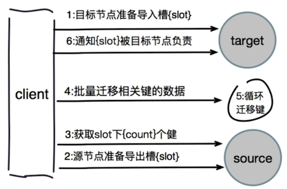
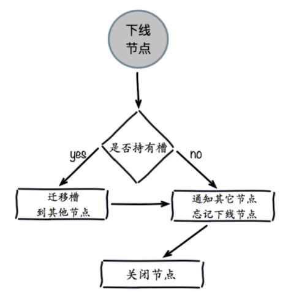
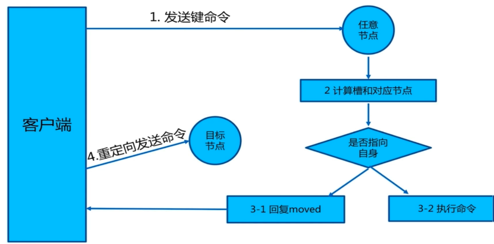
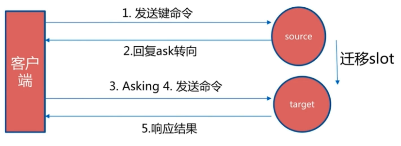
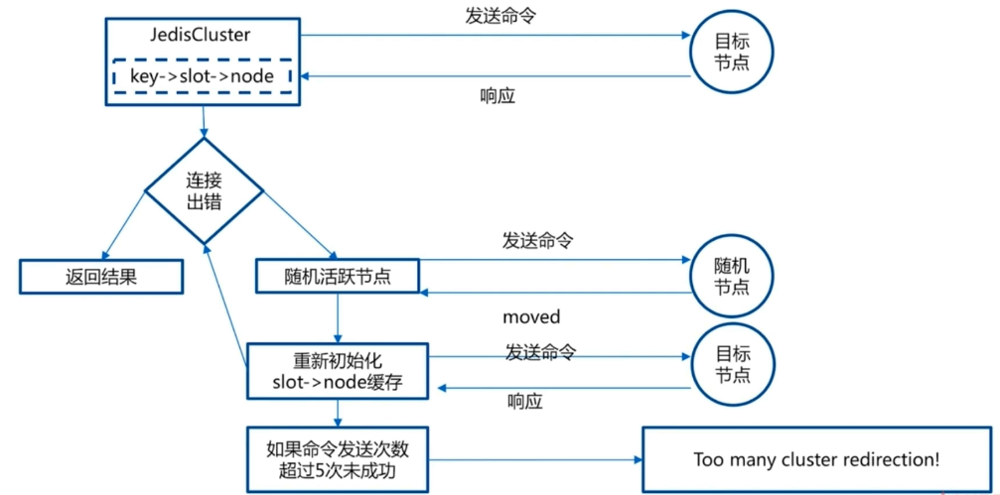
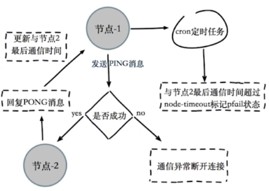
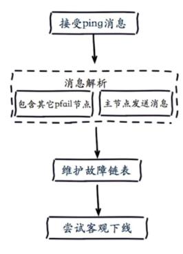
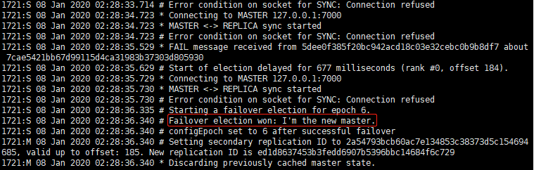
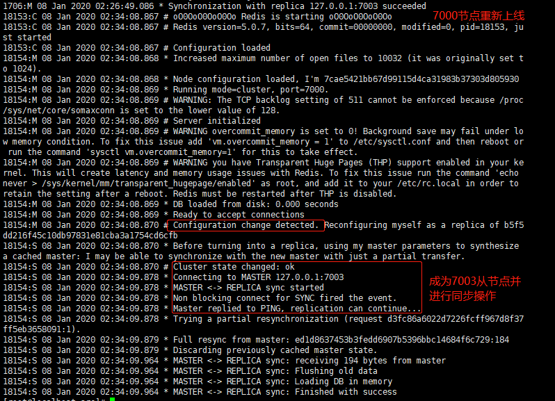

### 七. 集群——第二部分

### 7.1 伸缩原理

集群伸缩实质上就是：槽和数据在节点之间移动。

#### 7.1.1 集群拓展

扩展集群包括三个方面：

> 1. 准备新节点
> 2. 加入集群
> 3. 迁移槽和数据

**准备新节点**

新节点需要满足：

- 将节点配置为集群节点
- 配置和其他节点统一
- 启动后的新节点仍然是孤儿节点

**加入集群**

加入集群主要有了两个作用：

- 为它迁移槽和数据实现扩容
- 作为从节点负责故障转移：由于某些原因，原本的从节点下线了，需要有新的从节点负责故障转移过程

准备的新节点启动后，仍然是孤儿节点，需要将它们加入到集群中，即meet操作：

```shell
cluster meet ...
```

通过cluster nodes查看是否加入成功。

**迁移槽和数据**



- 指定槽迁移计划：要达到槽平均的目的

- 迁移数据：v3.0.6开始，支持pipeline migrate批量迁移

  1. 对目标节点发送cluster setslot {slot} importing {sourceNodeId}命令，让目标节点准备导入槽的数据

  2. 对源节点发送cluster setslot {slot} migrating {targetNodeId}命令，让源节点准备迁出槽的数据

  3. 源节点循环执行cluster getkeyinslot {slot} {count}命令，每次获取count个数据槽的主键

  4. 在源节点上执行migrate {targetIp} {targetPort} key 0 {timeout}命令指定key迁移，0代表数据库-0

  5. 重复执行3-4，直到槽下所有的数据键迁移到目标节点上

  6. 向集群内所有主节点发送cluster setslot {slot} node {targetNoded}命令，通知草分配给目标节点

**数据迁移演示**

```shell
# 准备两个新节点7006(slave) 7007(master)
>> sed "s/7000/7006/g" simple-cnf-7000.conf > simple-cnf-7006.conf
>> sed "s/7000/7007/g" simple-cnf-7000.conf > simple-cnf-7007.conf

# 将两个新节点加入到集群中，即进行meet操作
>> ./redis-cli -p 7000 -a tanglei cluster meet 127.0.0.1 7006
>> ./redis-cli -p 7000 -a tanglei cluster meet 127.0.0.1 7007

# 完成7007对7006主从复制
>> ./redis-cli -p 7007 -a tanglei cluster replicate {node-7006-id}

# 使用redis-trib.rb来完成扩容操作
# redis-trib.rb已经被redis-cli --cluster命令替换

# 现在要从7000、70001、7002拿出一部分节点分配给7006节点
# 最终4个master节点平分16384个节点，即每个节点4096个节点
>> ./redis-cli -a tanglei --cluster reshard 127.0.0.1 7000    # reshard命令完成
How many slots do you want to move (from 1 to 16384)? 4096
What is the receiving node ID? 1d21aad6240a8dbabdb3a417fc36ec8001a6d3cb
Please enter all the source node IDs.
Type 'all' to use all the nodes as source nodes for the hash slots.
Type 'done' once you entered all the source nodes IDs
Source node #1: all  
Do you want to proceed with the proposed reshard plan (yes/no)? yes

# 查看是否迁移成功
# 可以看到7006节点分配了三段槽[0, 1365]、[5462, 6826]、[10923, 12287]，共4096个：
>> ./redis-cli -p 7000 -a tanglei cluster nodes | grep master
...
1d21aad6240a8dbabdb3a417fc36ec8001a6d3cb 127.0.0.1:7006@17006 master - 0 1578456653326 6 connected 0-1365 5462-6826 10923-12287
...
```

#### 7.1.2 集群缩容

节点缩容，即下线集群中某些节点，主要包括3个步骤：

> 1. 下线迁移槽
> 2. 忘记节点
> 3. 关闭节点



**集群缩容演示**

```shell
# 将之前加入的7006、7007节点下线，并将对应的slots重新分配给另外三个master节点

# 将7006槽范围[0, 1365]，共1366节点迁移到7000节点上
>> ./redis-cli -a tanglei --cluster reshard --cluster-from {7006-node-id} --cluster-to {7000-node-id} --cluster-slots 1366 127.0.0.1:7006

# 将7006槽范围[5462, 6826]，共1366节点迁移到7001节点上
>> ./redis-cli -a tanglei --cluster reshard --cluster-from {7006-node-id} --cluster-to {7001-node-id} --cluster-slots 1365 127.0.0.1:7006

# 将7006槽范围[10923, 12287]，共1365节点迁移到7002节点上
>> ./redis-cli -a tanglei --cluster reshard --cluster-from {7006-node-id} --cluster-to {7002-node-id} --cluster-slots 1365 127.0.0.1:7006

# 查看7006节点的槽情况：
>> ./redis-cli -p 7000 -a tanglei cluster nodes | grep master
{7002-node-id} 127.0.0.1:7002@17002 master - 0 1578457999934 9 connected 10924-16383
{7006-node-id} 127.0.0.1:7006@17006 master - 0 1578457994000 6 connected
{7001-node-id} 127.0.0.1:7001@17001 master - 0 1578457997000 8 connected 5462-10923
{7000-node-id} 127.0.0.1:7000@17000 myself,master - 0 1578457998000 7 connected 0-5461

# 下线7007、7006节点，注意先下线从节点、在下线主节点
# del-node内部执行的是：cluster-forget命令
>> ./redis-cli -a tanglei --cluster del-node 127.0.0.1:7000 {7007-node-id}
>> ./redis-cli -a tanglei --cluster del-node 127.0.0.1:7000 {7006-node-id}
```


### 7.2 客户端路由

redis cluster客户端连接和redis sentinel有一些区别，主要从三个方面介绍：

> 1. moved重定向
> 2. ask重定向
> 3. smart客户端

#### 7.2.1 moved重定向



注意，如果不使用redis cluster模式（不携带-c参数），当通过CRC16计算出key不在当前节点维护的槽是，会有出moved异常，此时客户端不会自动重定向发送命令到目标节点，需要手动切换节点，重新发送命令。


使用redis cluster模式（携带-c参数）可以避免切换客户端重新发送命令过程，完成自动重定向发送命令：

```shell
# 7000客户端，维护slot范围：[0, 5461]
>> ./redis-cli -p 7000 -a tanglei 
>> cluster keyslot hello
(integer) 886
>> set hello world
OK
>> cluster keyslot php
(integer) 9244
>> set php best
(error) MOVED 9244 127.0.0.1:7001 # moved错误，key对应的槽在7001节点上

# 携带-c参数
>> ./redis-cli -c -p 7000 -a tanglei
>> set php best
-> Redirected to slot [9244] located at 127.0.0.1:7001  # 自动完成重定向
OK
```


#### 7.2.2 ask重定向



redis cluster在进行槽迁移时，会遍历源节点每一个槽，然后将其迁移到目标节点上。但是如果在迁移期间，客户端发送一条命令，经过计算该命令key在源节点的slot上，而该slot正在迁移过程中，此时客户端会受到ask转向异常，客户端需要重新发送Asking并重新发送命令。相对于moved异常：

- ask和moved都是客户端重定向操作
- moved异常：key所在的槽已经确定迁移到目标节点上了
- ask异常：槽还在迁移过程中，因此此时的key可能在源节点也可能在目标节点


#### 7.2.3 smart客户端

smart客户端原理是基于**追求性能**的，涉及基本思路：

- 从集群中选择一个可以运行的节点，使用cluster slots命令初始化槽和节点映射

- 将cluster slots的结果映射到本地，为每个节点创建JedisPool

- 准备执行命令，注意：

  - moved异常会刷新本地slot-node缓存
  - 如果是最后一次尝试时，也会刷新本地slot-node缓存

  

###  7.3 批量操作优化

mget、mset在redis cluster中执行时，必须要求多个key在同一个槽中，这是非常苛刻的要求。以下介绍四种方法进行优化：

- 串行mget、mset：将key串行化，使用for循环依次get、set对应的key，简单但是效率低下
- 串行IO：在串行meget、mset上进行优化，客户端维护K个subKeys集合，将原本m个key聚合到K个集合中，这样原本m次网络时间缩短为K次网络时间
- 并行IO：在串行IO基础上优化，串行IO中K个子集合是依次发送到服务端，并行IO就可以使用多个线程并发地发送到服务器端
- hash_tag：对所有的key进行一次hash_tag包装，让所有的key落到同一个redis节点上

**四种优化比较**

| 方案     | 优点                                   | 缺点                                             | 网络IO            |
| -------- | -------------------------------------- | ------------------------------------------------ | ----------------- |
| 串行mget | 编程简单<br />少量keys满足需求         | 大量keys请求延迟严重                             | O(keys)           |
| 串行IO   | 编程简单<br />少量节点满足需求         | 大量node延迟严重                                 | O(nodes)          |
| 并行IO   | 利用并行特性<br />延迟取决于最慢的节点 | 编程复杂<br />超时定位难                         | O(max_slow(node)) |
| hash_tag | 性能最高                               | 读写增加tag维护成本<br />tag分布容易出现数据倾斜 | O(1)              |

### 7.4 redis cluster故障转移

redis cluster不需要向redis sentinel那样配置额外的sentinel节点完成故障转移过程，因为它自身就实现了高可用方案。

#### 7.4.1 故障发现

redis cluster故障发现不需要通过sentinel节点，而是通过ping/pong消息实现故障发现。当出现故障出现时，也有主观下线和客观下线之分。

- 主观下线：



- 客观下线：当半数以上持有槽的主节点都标记某个主节点主观下线



- 尝试客观下线：
  - 计算有效下线报告数量，
  - 如果改数量大于槽节点总数一半：更新为客观下线，并向集群广播下线节点的fail消息
  - 否则直接退出

#### 7.4.2 故障恢复

- 资格审查：对slave节点进行检查，只有资格审查通过的从节点，才能成为master节点。资格检查主要检查：每个从接单和故障主节点的断线时间，这里涉及到两个参数：

  - cluster-node-timeout：cluster节点的超时时间，默认15s
  - cluster-slave-validity-factory：默认10

  断线时间如果超过：cluster-node-timeout * cluster-slave-validity-factory（默认150s），则失去资格

- 准备选举时间：让偏移量最大（复制更完整）的salve节点拥有更小的延迟选举时间，从而有更大可能成为新的master节点

- 选举投票：当准备选举时间到达时，会要求master节点进行投票，当slave节点获得总master节点数一半以上时，开始准备替换主节点

- 替换主节点：

  - 当前从节点取消复制成为主节点（slaveof no one）

  - 执行clusterDelSlot撤销故障主节点负责的槽，并执行clusterAddSlot把这些槽分配给自己
  - 向集群广播自己的pong消息，表明自己已经替换了故障从节点

#### 7.4.3 故障演练

注意之前redis cluster集群中六个节点都设置了登录密码，在出现故障时，任何一个slave节点都有可能晋升为master节点。因此：所有的slave节点和master节点密码都必须相同，并且都必须配置**masterauth**参数：

```shell
>> echo "masterauth tanglei" >> simple-cnf-7000.cnf
>> echo "masterauth tanglei" >> simple-cnf-7001.cnf
>> echo "masterauth tanglei" >> simple-cnf-7002.cnf
>> echo "masterauth tanglei" >> simple-cnf-7003.cnf
>> echo "masterauth tanglei" >> simple-cnf-7004.cnf
>> echo "masterauth tanglei" >> simple-cnf-7005.cnf
```

- kill -9 {7000-node-pid}
- 查看节点7003日志：



- 将7000节点重新上限，并查看7000节点日志：



### 7.5 redis cluster运维常见问题

#### 7.5.1 集群完整性

集群完整性设计的配置：cluster-reuire-full-converage，默认为yes，即要求：

- 集群中16384个槽全部可用，保证集群完整性
- 节点故障或者正在故障转移过程中，集群也无法使用

对于大部分业务而言，将该参数设置为yes都是不合理的。

#### 7.5.2 带宽消耗

redis cluster各个节点之间节点之间通过Gossip协议交换消息，以及相关的ping/pong命令，当集群节点数量不断增加时，网络带宽消耗的影响不能够忽略，官方建议redis cluster对多1000个节点。网络带宽影响的三个方面：

- 消息发送频率：节点发现和其他节点最后通信时间超过cluster-node-timout/2时会直接发送ping消息
- 消息数据量：slots槽数组（2KB）和整个集群1/10的状态数据（10个节点状态数据约1KB）
- 节点部署的机器规模：集群分布的机器越多且每台机器划分的节点数越均匀，则集群内整体的可用带宽越高

相关优化：

- 避免多个业务使用同一个集群，但是大业务推荐使用多集群
- cluster-node-timeout：会影响带宽和故障转移速度，因此需要平衡
- 尽量均匀分配到多机器上，保证高可用和带宽

#### 7.5.3 pub/sub广播

对集群中某个节点发送消息时，会在集群中每个节点上进行广播，加重带宽消耗。

#### 7.5.4 集群倾斜

分布式系统中出现倾斜问题非常常见，包括两个方面：

- 数据倾斜：
  - 节点和槽分配不均匀：可以使用reblance命令进行均衡
  - 不同槽对应键值数量差异非常大
  - 包含big key：redis-cli --bigkeys发现bigkey，建议在slave上查询
  - 内存相关配置不一致
- 请求倾斜：热点数据不均匀或者bigkey
  - 避免bigkey
  - 热键不要使用hash_tag
  - 当一致性不高时，可以使用本地缓存 + MQ

#### 7.5.5 集群读写分离

只读连接：集群模式下，从节点不接受任何读写请求：

- 重定向到负责槽的主节点
- readonly命令可以读：但是它是一条连接级别的命令，断开连接后下一次需要重新设置

读写分离：更加复杂，集群模式下，不建议使用读写分离

#### 7.5.6 在线、离线迁移

- 官方迁移工具：redis-trib.rb import:
  - 只能从单机迁移到集群
  - 不支持在线迁移，source节点需要停写
  - 不支持断点续传
  - 单线程迁移：影响速度
- 在线迁移：
  - 唯品会：redis-migrate-tool
  - 豌豆荚：redis-port

#### 7.5.7 集群限制

- key批量操作支持有限，例如mget、mset必须在一个slot中
- key事物和Lua支持有限：所有key必须在一个节点
- key是数据分区的最小粒度：不支持bigkey分区
- 不支持多个数据库：集群模式下只有一个db 0，单机模式下也不建议使用
- 主从复制只支持一层结构：不支持树形主从复制结构

很多场景下，redis sentinel已经足够了。

redis cluster能够满足容量和性能的拓展性，但是对很多业务而言，没有必要。

### 7.6 总结

- redis cluster数据分区规则采用虚拟槽（16384个槽），每个节点负责一部分槽和相关数据，实现数据和请求的负载均衡
- 搭建集群的基本步骤：准备节点、节点握手、主从复制、分配槽，也可以使用redis-trib.rb工具进行快速集群搭建
- 集群伸缩通过在节点之间移动槽和相关数据实现：
  - 扩容时：根据槽迁移计划，把槽从源节点迁移到目标节点上
  - 缩容时：下线的节点如果有负责的槽，需要将这些槽迁移到其他节点上，再通过cluster forget命令让集群内所有节点忘记被下线节点
- 使用smart客户端操作集群达到通信效率最大化，客户端内部负责计算维护键->槽->节点映射，用于快速定位到目标节点
- 集群自动故障转过程分为故障发现和节点恢复两个过程。从节点负责对主观下线的主节点触发故障恢复流程，保证集群的可用性
- 开发运维常见问题：超大规模集群带宽消耗，pub/sub广播问题，集群数据倾斜问题，单机和集群对比等