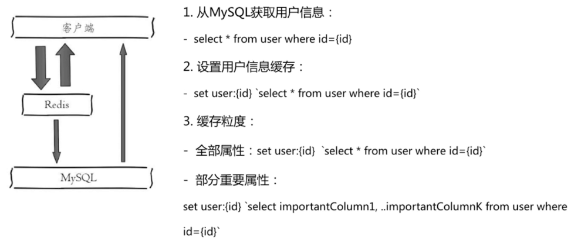

## 八. 缓存设计和优化

### 8.1 收益和成本

#### 8.1.1 收益

- 通过缓存加速读写速度：CPU L1/L2/L3 Cache、Linux page Cache加速硬盘读写、浏览器缓存、Ehcache缓存数据库结果
- 降低后端负载：后端服务器通过前端缓存降低负载：业务端使用Redis降低后段MySQL负载等

#### 8.1.2 成本

- 缓存层和数据层有时间窗口不一致问题，和更新策略有关系
- 多了一层缓存逻辑，增加代码维护成本
- 增加运维成本

#### 8.1.3 使用场景

- 对高消耗的SQL：join结果集、分组统计结果缓存
- 加速请求响应：利用redis、memcache优化响应时间
- 大量写和并为批量写：例如计数器，先使用redis在进行批量写操作进入db

### 8.2 缓存更新策略

缓存更新常用的三种策略：

- LRU、LFU、FIFO算法剔除：例如maxmemory-policy
- 超时剔除：例如expire
- 主动更新：开发控制生命周期

| 策略           | 一致性 | 维护成本 |
| -------------- | ------ | -------- |
| LRU、LFU、FIFO | 最差   | 低       |
| 超时剔除       | 较差   | 较低     |
| 主动更新       | 强     | 高       |

缓存更新策略使用建议：

- 低一致性业务：最大内存和淘汰策略
- 高一致性业务：超时剔除和主动更新结合，最大内存和淘汰策略兜底


### 8.3 粒度控制问题

通常情况下，都是使用redis去保护底层MySQL，但是这也涉及到缓存数据粒度控制问题：到底是缓存数据的全量数据好，还是缓存数据的部分几个重要的属性更好？



建议：

- 通用性：全量属性缓存更好，因为将所有数据都缓存，之后不管对对象加什么属性，都不需要修改
- 占用空间：部分属性好，特别是在对对象进行序列化时候
- 代码维护性：表面上全量属性更好

实际开发中，虽然全量数据缓存有利于业务的拓展性，考虑业务的拓展性也是非常好的思想，但是真实业务很多情况下业务需求不会发生变化，此时直接缓存部分重要数据即可。

### 8.4 缓存穿透

缓存存在的意义是为了保护底层MySQL等存储层，但是如果有大量请求发生不命中情况，即所有请求都直接穿透到MySQL存储层，那么缓存存在就没有意义，此时就是缓存穿透。

产生原因：

- 自身代码编写不规范：例如没有将MySQL中拿到的数据会写到缓存中
- 恶意攻击：恶意用户故意知道很多不存在的key，导致每次请求都直接穿透到存储层

解决方案：

- 进行一些必要的参数校验，如果不满足直接返回
- 缓存空对象：如果存储层也没有对象，构造一个key，对应的value为null放入到缓存中，构造空对象，但是也会带来新的问题：
  - key过多：需要设置定时时间
  - 短期时间窗口数据不一致：因为设置了定时时间，必定会在短期时间窗口内发生数据不一致问题。可以通过发布订阅方式订阅服务是否恢复正常等
- bloom过滤器：在缓存层增加一层bloom filter，如果bloom filter认为对应的key不存在，那么就一定不存在，直接返回；如果bloom filter认为存在，则可能存在，就去数据层查找并回写。

### 8.5 无底洞问题

无底洞问题：“加”更多机器性能没能提升，反而下降，即**更多机器 不等于 更高的性能**。

当节点数量很多少，网络IO时间的消耗就必须考虑，因为redis本身而言绝大多数命令非常快，当节点数量非常大时，网络IO消耗时间的常数项就必须考虑：

优化IO的几种方案：

- 命令本身优化：例如查询keys、hgetall bigkey
- 减少网络通信次数
- 降低接入成本：例如客户端长链接、连接池、NIO等

主要从IO本身优化考虑，忽略redis命令本身。在上一章已经介绍过：

- 串行mget

- IO串行化
- IO并行化
- hash_tag

### 8.3 热点key重建

如果某个key在缓存中没有命中，但是从数据库中获取到了，需要对key进行会写重建。如果该key是一个热点key，同时重建时间较长，那么就会有热点key重建问题。

热点key重建的目标：

- 减少重建缓存的次数
- 数据尽可能一致
- 减少潜在风险

两个解决方法：

- 互斥锁
- 永不过期

#### 8.3.1 互斥锁

将热点key重建的过程加锁互斥，让其它线程只能够等待，可以保证数据的强一致性问题。

```java
// 伪代码
String get(String key) {
    String value = redis.get(key);
    if (value == null) {
        String mutexKey = "mutex:key:" + key;
        if (redis.set(mutexKey, "1", "ex 180", "nx")){
            value = db.get(key);
            redis.set(key, value);
            redis.delete(mutexKey);
        }else{
            // 其它线程休息50ms
            Thread.sleep(50);
            get(key);
        }
    }
    return value;
}
```

#### 8.3.2 永不过期

- 缓存层面：没有设置过期时间（没有用expire）
- 功能层面：为每个value添加逻辑过期时间，但发现超过逻辑过期时间后，会使用单独的线程去构建缓存

```java
// 伪代码
String get(final String key) {
    V v = redis.get(key);
    long logicTimeout = v.getLogicTimeout();
    if (logicTimeout >= System.currentTimeMillis()){
        String mutexKey = "mutex:key:" + key;
        if (redis.set(mutexKey, "1", "ex 180", "nx")){
            // 异步更新后台异常执行
            threadPool.execute(new Runnable(){
                public void run() {
                    String dbValue = db.get(key);
                    redis.set(key,(dbValue, newLogicTimeout));
                    redis.delete(mutexKey);
                }
            });
        }
    }
    return value;
}
```

#### 8.3.3 两种方案对比

| 方案     | 优点                     | 缺点                                                 |
| -------- | ------------------------ | ---------------------------------------------------- |
| 互斥锁   | 思路简单<br />保证一致性 | 代码复杂度增加<br />存在死锁风险                     |
| 永不过期 | 基本杜绝热点key重建问题  | 不保证一致性<br />逻辑过期时间增减维护成本和内存时间 |

