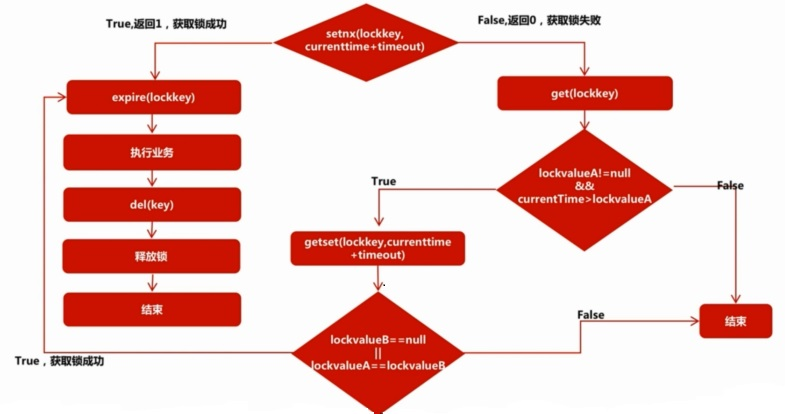

以上笔记1-8基本整理自慕课网课程：https://coding.imooc.com/class/151.html

以下内容根据[敖丙](https://github.com/AobingJava/JavaFamily)《吊打面试官系列》整理补充。

------


## Redis数据结构有哪些数据结构

-   基本五种：String、Hash、List、Set、Sorted
-   其它：HyperLogLog、GEO、Bitmap、Stream（v5.0）、BloomFilter（Module形式）

## 有大量Key同时过期要注意什么问题

电商首页经常会使用定时任务刷新缓存，大量key过期时间设置过于集中，在过期时间点上，如果正好有流量峰值，会直接穿透到DB，造成缓存雪崩。一般只需要将过期时间加上一个随机值，使得过期时间分散一点即可。

## Redis分布式锁怎么使用

那setnx争抢锁，并设置过期时间来释放锁。如果获取锁的线程突然掉线，或者服务器宕机，此时会出现锁一直得不到释放，造成死锁。

-   如果是tomcat使用shutdown方式关闭，可以使用@PreDestroy注解方法，在被注解的方法内部删除锁。
-   否则应该配合getset原子指令，判断当前时间是否超过了锁的过期时间。如果过期，也不能直接删除，会导致两个线程同时获取锁。需要使用setget拿到锁的旧值和最开始的get获取的值进行比较，判断在此期间是否有其它线程获取了锁：



伪代码：

```java
private static  final String LOCK = "LOCK";
private final long lockTime = 5000L;

public void closeOrder() {    
    long result = redis.setnx(LOCK, String.valueOf(System.currentTimeMillis() + lockTime));
    if (result != null && result.intValue() == 1) {
        // 获取锁成功
    }else {
        // 未获取到锁，尝试查看锁是否过期
        String valueStr = redis.get(LOCK);
        if (valueStr != null && (System.currentTimeMillis() > Long.parseLong(valueStr))){
            String oldValue = redis.setnx(LOCK, String.valueOf(System.currentTimeMillis() + lockTime));
            if (oldValue == null || oldValue.equals(valueStr)) {
                // 获取锁成功
            }else {
                // 获取锁失败
            }
        }else {
            // 获取锁失败
        }
    }
}
```

## 加入Redis里面有1亿个key，其中10w个key是以某个固定的已知前缀，怎么把它们找出来?

-   keys命令：O(n)，线上环境不能使用
-   scan命令：相比keys、smembers等，scan是增量式迭代，每次执行只会返回少量元素，是居于游标的迭代器。

scan命令返回包含两个值的数组，第一个是下一次迭代的新游标，第二个是包含元素的数组。以0作为游标开始一次新的迭代，一直调用scan命令，直到命令返回游标 0，我们称这个过程为一次**完整遍历**（full iteration）。

scan命令，以及其他增量式迭代命令，在进行完整遍历的情况下可以为用户带来以下保证：从完整遍历开始直到完整遍历结束期间，一直存在于数据集内的所有元素都会被完整遍历返回；这意味着，如果有一个元素，它从遍历开始直到遍历结束期间都存在于被遍历的数据集当中，那么scan命令总会在某次迭代中将这个元素返回给用户。

但是对于scan这类增量式迭代命令来说，因为在对键进行增量式迭代的过程中，键可能会被修改，所以增量式迭代命令只能对被返回的元素提供有限的保证（offer limited guarantees about the returned elements）。

上面的问题中可以使用：`scan {游标} match {pattern} count {num}`

scan命令可以参考：http://doc.redisfans.com/key/scan.html

## Redis做异步队列？

-   直接使用list，用它对应的两个api，注意没有消息时，需要sleep一下重试

    -   rpush生产消息

    -   lpop消费消息
- list也有阻塞版本：blpop、brpush
-   可以使用pub/sub功能完成：1：N的消息队列，但是pub/sub没有传统的消息队列的消息堆积功能
-   Redis 5.0开始提供Stream流，也可以完成生产者消、费者模式

## Redis如何实现延迟队列？

使用sortedset，使用时间戳作为score，消息内容作为key并调用zadd生产消息，消费者使用zrangebyscore指令获取N秒之前的数据轮训处理。

Redis持久化？

-   RDB：做数据库镜像，fork一个子进程，父子进程共享数据段，父进程继续提供读写服务，子进程copy on write操作
-   AOF：日志追加模式，redis优先使用aof，根据不同需求（是否容忍丢失数据）进行配置参数

真实环境下都是使用：冷热备份、异地备份，RDB做冷备份，AOF做热备份，出现问题第一时间使用RDB进行恢复，然后AOF做数据补全。

## pipeline有什么好处？

Redis是万级别qps，每条指令是微秒级别的，当大量数据串行传输时，网络时延需要考虑。

## 缓存雪崩？

缓存中所有的key在同一时间全部失效，请求全部打在DB上，导致DB扛不住宕机。服务器重启后，所有的请求又会重新打到DB上，继续宕机。可以让缓存中key的过期时间加上随机值：

​								`setRedis(key, value, time + Math.random() * 10000);`

或者热点数据永不过期，例如电商首页的数据可以永不过期，比较保险。

## 缓存穿透？

请求直接绕开缓存，直接穿透到DB，使得缓存根本没有作用。可以是有人恶意发来请求，包含根本就不存在的字段，当然在缓存中查询不到，需要穿透到DB中查找，一旦这样的恶意请求量非常大，就会出现缓存穿透。

解决：

-   增加各种校验功能，不合法的请求直接返回
-   如果缓存中查不到，DB中也查不到，返回请求一个null，并把null作为会写到缓存中，下一次查找直接返回null。当然要设置过期时间，不然之后可能数据库中有数据，但是缓存中仍然为null。这种方案存在一定时间的不同步问题
-   在缓存之前增加一个bloom过滤器层，如果bloom显示没有，那说明真的没有直接返回null，否则再去DB中缓存、DB中查找是否真的有。

## 缓存击穿？

和缓存雪崩类似，缓存击穿就是因为热点数据的存在，在很长的一段时间内一直有大并发存在，如果这个热点数据设置了过期时间，且过期时间在大并发存在时间范围内，会导致请求直接穿透到DB，造成击穿。

一般对于这样的热点数据，不设置过期时间即可。

## Redis内存淘汰机制？

Redis过期策略使用：定期删除+惰性删除

设置一个定期时间，但是redis不会扫描所有的key（否则就和keys命令一样了），而是扫描一部分key，如果过期就直接删除，这是定期删除。

对于已经过期的数据，但是定期删除没有扫描到，会使用惰性删除。当查询该key时，先判断一下是否过期，过期就直接删除。

但是对于有些已经过期的key，定期扫描没扫描到，有没有请求访问到它，不能进行惰性删除，导致一直存在数据库中。这时候就需要内存淘汰策略，一般使用LRU算法（Java中LinkedHashMap也使用了LRU，当元素大于100时，开启该策略）。