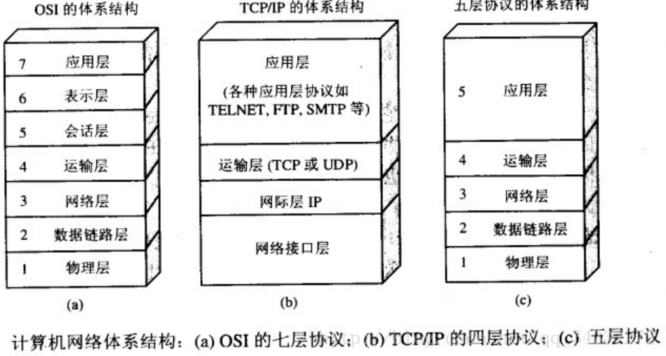
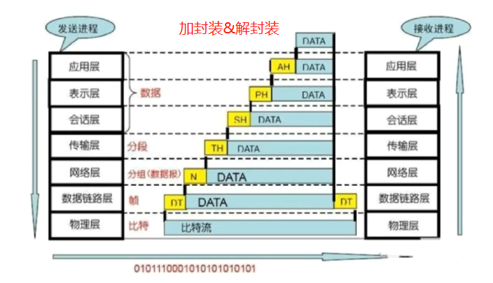
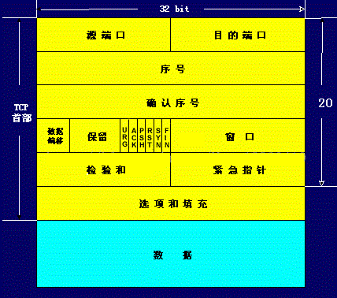
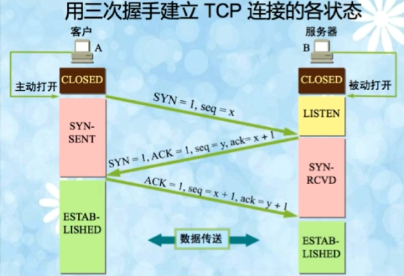
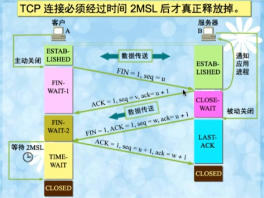
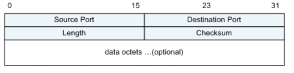
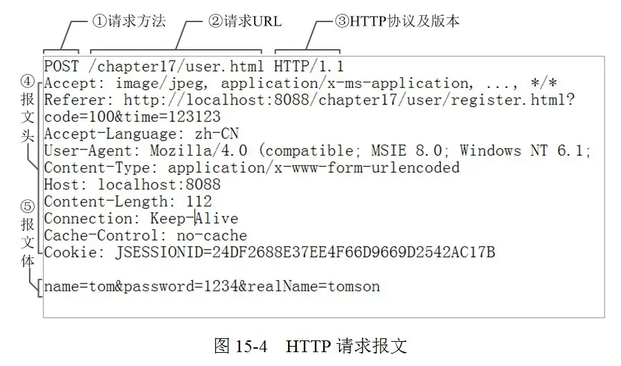
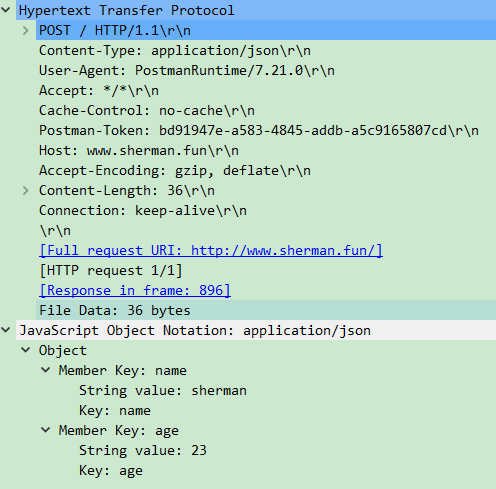
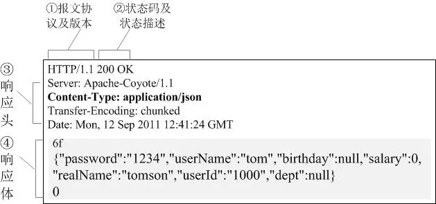
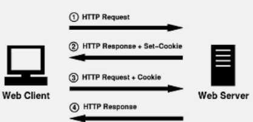

## 一. 网络

### 1.1 OSI和TCP/IP分层



- 应用层：应用进程间的交互来完成特定网络应用：TFTP、FTP、SMTP、DNS、Telnet、Http、Https等
- 传输层：负责向两台主机进程之间的通信提供通用的数据传输服务：TCP、UDP
- 网络层：网络层的任务就是选择合适的网间路由和交换结点， 确保数据及时传送：IP协议
- 数据链路层：两台主机之间的数据传输，总是在一段一段（将IP数据报封装为帧）的链路上传送：每一个帧包括数据和必要的控制信息（同步信息、地址信息、差错控制等），ARP、RARP、MTU、IEEE802、IEEE802.2、ISO2110

两个应用层之间相互发送消息，即对数据在不同层之间加封装和解封装的过程：



### 1.2 三次握手


#### 1.2.1 TCP协议

- 面向连接的、可靠地、基于字节流的传输层通信协议
- 将应用层的数据流分割成报文段并发送给目标节点的TCP层
- 数据包都有序号，对方收到则发送ACK进行确认，未收到则重传


#### 1.2.2 TCP报文头



- 端口号：TCP报文头部的源端口号和目的端口号同IP数据报中的源IP和目的IP唯一确定一条TCP连接：`{source_ip:source_port} -> {destination_ip:destination_port}`
  - 源端口：发送计算机上应用程序的端口号
  - 目的端口：接受计算机上应用程序的端口号
- :star:序号（sequence number）：4字节，**TCP可靠传输的关键**，seq是本报文段发送数据组的第一个字节的序号，且在TCP传送的数据流中，每传输一个字节，seq加1。例如一个报文段的seq为300，共传输100字节数据流，则下一个报文段的seq为400。seq和确认号ACK（期待下一次收到的字节，例如上面例子中，下一次期待收到的字节号就是401）配合保证TCP的可靠传输
- :star:确认序列号（Acknowledgement number）：4字节，**指明下一次期待收到的序列号**，如果最后一次收到的seq为k，那么下一次期待收到的序列号为k+1
- 数据偏移量（Offset）：4bits，TCP头部可以包含可选项内容，因此TCP报文头部是不固定的，报文不包含任何字段时长度为20字节，4bits的首部长度所表示的最大长度为1111 -> 15，最大长度为15 * 4bytes = 60bytes，故报文最大长度为60字节。因此，Offset实际指示了数据区在报文段的其实起始偏移值。
- 保留字段：4bits，为将来定义新用途保留，一般置0即可
- 控制位：2bytes，每个控制位表示一个控制功能，主要有6个
  - URG：紧急指针标志，置1时表示后面的紧急指针有效，置0表示忽略后面的紧急指针
  - :star:ACK：确认序号标志，置1时表示上面ACK（上面4字节的ACK）有效，置0表示报文中不含确认信息
  - PSH：push标志位，置1时应用端应尽快将数据交给客户端，而不是堆积在缓冲区
  - RST：重置连接，用于拒接非法连接或者拒绝请求连接
  - :star:SYN：同步序号，用于建立连接过程，和ACK配合使用：SYN=1&&ACK=0，表示没有使用捎带确认域，SYN=1&&ACK=1，表示捎带一个确认域
  - :star:FIN：finish标志，用于释放连接，注意表示的是发送发没有数据发送了，关闭**本方**数据流
- 窗口（Window）：滑动窗口大小，用来告知发送端接受端的缓存大小，以此控制发送端发送数据的速率，从而达到流量控制。窗口大小时一个16bit字段，因而窗口大小最大为65535
- 校验和（Checksum）：此校验和是对整个的 TCP 报文段，包括 TCP 头部和 TCP 数据，以 16 位字进行计算所得
- 紧急指针：只有当 URG 标志置 1 时紧急指针才有效。紧急指针是一个正的偏移量，和顺序号字段中的值相加表示紧急数据最后一个字节的序号。TCP 的紧急方式是发送端向另一端发送紧急数据的一种方式。
- 可选项和填充：最常见的可选字段是最长报文大小，又称为**MSS**（Maximum Segment Size），每个连接方通常都在通信的第一个报文段（为建立连接而设置SYN标志为1的那个段）中指明这个选项，它表示本端所能接受的最大报文段的长度。选项长度不一定是32位的整数倍，所以要加填充位，即在这个字段中加入额外的零，以保证TCP头是32的整数倍。
- 数据部分： TCP 报文段中的数据部分是**可选的**。在一个连接建立和一个连接终止时，双方交换的报文段仅有 TCP 首部。如果一方没有数据要发送，也使用没有任何数据的首部来确认收到的数据。在处理超时的许多情况中，也会发送不带任何数据的报文段。


#### 1.2.3 TCP三次握手

当应用程序希望和另一个应用程序进行通信时，需要通过三次握手建立**可靠连接**，该连接是全双工的。



- 第一次握手：建立连接时，客户端发送SYN包（seq=x）到服务端，并进入SYN_SEND状态，等待服务器确认
- 第二次握手：服务器收到SYN包，必须确认客户的SYN包（ack=x+1），同时自己也发送一个SYN包（seq=y），即服务器向客户端发送了一个SYN+ACK包，此时服务器进入SYN_RCVD状态
- 第三次握手：客户端接收到服务器的SYN+ACK包，向服务器发送一个确认包ACK（ack=y+1），此包发送完毕后，客户端和服务器进入ESTIBLISHED状态，完成三次握手。
- 注意第三次握手的时候可以携带数据（当然也可以不携带，那么seq就不用x+1），前两次握手都不可以携带数据

:star:为什么需要三次握手才能建立连接：

为了保证可靠连接，即确认双方的接收和发送都是正常的，即**为了初始化sequence number的初始值**。因为TCP传输是以报文段进行传输，传输关闭后需要将报文段通过**seq**重新组合起来，防止报文段乱序，那么就必须知道seq的初始值。


#### 1.2.4 SYN超时和SYN Flood攻击

客户端发送seq进行第一次握手成功后，由于某种原因断开连接了，服务端向客户端发送SYN+ACK包后进入SYN_RCVD状态，但是一直等不到客户端确认。此时Server会不断重试直至超时，在Linux系统下，默认进行6次尝试，每次尝试间隔为1s、2s、4s、8s、16s、32s，共计63s，63s后仍然没有收到ACK包才会断开连接。


**SYN Flood攻击**

恶意程序大量向服务器发送SYN包后就主动断开连接，导致服务器一直处于SYN_RCVD状态，并且需要等待63s后才会释放连接，服务器的SYN连接队列耗尽后，导致正常连接请求失败。


**针对SYN Flood防护措施**

当SYN队列满后，服务端通过源、目的地址端口、当前时间戳构造出一个特别的sequence number，简称**SYN Cookie**，并通过tcp_syncookies参数回发给客户端。正常的客户端接收到SYN Cookie后直接将其原样返还给服务器，服务器接收到原样回发的SYN Cookie后会**直接建立连接**，不需要经过三次握手。恶意攻击的请求并不会回发SYN Cookie，导致连接直接断开。


#### 1.2.5 TCP保活机制

在需要长连接的网络通信程序中，经常需要心跳检测机制，来实现检测对方是否在线或者维持网络连接的需要。TCP建立连接后，如果在一段时间内双方都没有互相发送任何数据，那么就有两个问题：

- 怎么判断对方是否还在线？
- 长时间没有任何数据发送，连接是否可能被中断？

TCP的报活机制就是为了解决这样的问题：

- 连接双发会向对法发送探测报文，如果未收到响应则继续发送
- 在尝试次数达到报活探测次数仍然未收到响应，则判定连接不可达，中断连接

```shell
# 保活时间，7200s
[root@aliyun ~]# cat /proc/sys/net/ipv4/tcp_keepalive_time
7200
# 报活时间间隔，75s
[root@aliyun ~]# cat /proc/sys/net/ipv4/tcp_keepalive_intvl 
75
# 报活探测数，9次
[root@aliyun ~]# cat /proc/sys/net/ipv4/tcp_keepalive_probes 
9
```

### 1.3 四次挥手



在Socket编程中，客户端和服务端都可以通过调用close方法进行连接释放，这里以客户端主动释放连接为例，说明四次挥手：

- 客户端主动关闭，发送SYN报文（FIN=1，seq=u）并进入FIN-WAIT-1状态，FIN只表明本端已经没有数据要发送了，但是还是可以接受对方发送数据
- 服务端接收到客户端的SYN-ACK报文（ACK=1，ack=u+1，seq=v，之后进入CLOSE-WAIT状态
- 客户端收到服务端的ACK报文后进入FIN-WAIT-2状态，但是此时服务端可能还有数据继续发送。一段时间后，服务端所有数据发送完毕，并发送SYN-ACK报文（FIN=1，ACK=1，ack=u+1, seq=w），准备释放服务端连接，并进入LAST-ACK状态
- 客户端收到服务端ACK-SYN报文后，发送SYN-ACK报文（ACK=1，ack=w+1，seq=u+1）给服务端，进入TIME-WAIT状态，并等待**2MSL**时间后关闭连接进入CLOSED状态
- 服务端收到客户端的SYN-ACK报文后，直接关闭进入CLOSED状态


#### 1.4.1 等待2MSL时间

MSL（Maximum Segment Lifetime）：最长报文段寿命，客户端为什么要等待2MSL时间才进入CLOSED状态？

- 保证最后一个ACK报文能够收到：如果服务端没有收到最后的ACK确认，会进行超时重传，一来一回就是2MSL时间。
- 避免新旧连接混淆：有些路由器会缓存ip数据包，延迟收到的包可能和之后收到的包混合


#### 1.4.2 为什么需要四次挥手才断开

因为TCP是全双工的，每次FIN标志位置为1仅仅表示本端不再发送数据，但是还可以接受数据。四次挥手保证了发送方和接收方都需要的FIN报文和ACK报文。更具体的说：

在服务器收到客户端的FIN标志位时，知道客户端想要关闭连接，但是服务端可能还有数据没有发送完毕。如果此时服务器直接ACK&FIN，会导致服务端未发送的数据传输失败。因此，服务端只能先回复客户端一个ACK表明自身已经收到客户端的关闭请求，但是要等到自身将数据发送完毕后在发送一个FIN，请求关闭连接。所以原本一次可以完成的确认（ACK）和关闭（FIN）操作被分为两个部分，导致需要四次挥手。


#### 1.4.3 服务器出现大量CLOSE_WAIT状态

从四次挥手示意图可以看出，服务器出现大量CLOSE_WAIT状态，只能是服务端数据发送完毕后，没有发送FIN进行关闭连接，导致一直处于CLOSE_WAIT状态。出现这样的原因大多数是由于代码本身逻辑产生的：例如对方关闭socket连接，而自身忙于度或者写，没有及时关闭连接。


### 1.4 UDP


#### 1.4.1 UDP报文头

UDP报文头相比TCP而言要简单很多只有4个字段，8个字节：




#### 1.4.2 UDP特点

- 面向无连接
- 不维护连接状态，支持同时向多个客户端传输相同消息（适合一对多的多播）
- 数据包报头只有8个字节，额外开销小
- 吞吐量不受拥塞控制算法影响，只收数据生成速度、传输带宽以及机器性能影响
- 尽最大努力交付，不保证可靠性，不需要维护复杂的连接状态表
- 面向报文，不对应用程序提交的报文进行拆分或者和和并


#### 1.4.3 UDP和TCP区别 

- 面向连接vs无连接
- 可靠性
- 有序性
- 速度：UDP适合即时通信方式（QQ语音、QQ视频、直播、多人在线游戏）
- 量级


### 1.5 TCP滑动窗口

[参考](https://www.imooc.com/article/29368)

#### 1.5.1 为什么需要滑动窗口

TCP协议是可靠传输，在滑动窗口之前，通常采用**send-wait-send**策略保证数据可靠性，也成为stop-wait策略：发送方发送数据后会启动一个定时器，如果数据丢失，那么定时器到时间后，就需要进行重传，从而保证可靠性。但是，这是一种同步的方式，效率低下。

对send-wait-send模式进行优化的思路就是一次性发送多个片段，而不是要等到ack确认之后才继续发送下一个数据。但是这也带带来新的问题：多个数据发送后，接受端接收到多个数据包，可能出现乱序，或者先接受到靠后的数据，而靠前的数据还在传输过程中，此时就需要等待。并且如果一段时间没有接收到靠前的数据，就必须drop掉，以此来保证顺序性。

滑动窗口就是为了解决上述**传输效率**和**顺序性**问题。


#### 1.5.2 数据分类

从数据是否能发送、是否已发送角度可以给数据分为四类：

​	1. Send and Acknowledged：数据已经被发送并且已经被确认过

​	2. Send but Not Yet Acknowledged：数据已经被发送但是还未被确认过

​	3. Not send, Recipient Read to Receive：数据已经被加载到缓存中等待发送，但是还没有发送

​	4. Not send, Recipient Not Read to Receive：数据未发送，且不允许发送，因为这些数据超出了发送端接受的范围


接收端也有类似的接受窗口，但是只有三个分类，没有第一类，因为接受端并不需要等待ACK。

滑动窗口内**只包含2、3两类数据**，第1类已经确认过，第4类不允许发送。


#### 1.5.3 动态窗口调整

根据接收端的接受情况，动态去调整Window Size，然后控制发送端的数据流量。动态窗口大小调整和两个时间有关系：

- RTT（Round Trip Time）：一个数据包从发出时间到回来的时间，通过这个时间大约知道多少时间
- RTO（Retransmission Timeout）：重传时间间隔，是本次发送当前数据包预估的超时时间，RTO需要很好的算法来估计，不是一个固定的值。


### 1.6 TCP如何保证可靠传输

- 将应用数据分割成TCP认为最合适发送的数据块，然后给每个数据块编号，接收方按照编号重新排序
- 校验和：TCP会对TCP头部和数据一起做一个校验和，这是端到端的校验和，检测数据在传输过程中是否发生变化，如果发生变化，直接丢弃
- 丢弃重复数据
- 流量控制：使用流量控制保证发送速度和接受速度相匹配，防止网络拥堵发送丢包
- 拥塞控制：当网络拥塞时，通过改变Window Size大小，减少数据发送。特别当Window Size=0时，不接受数据，发送方不能发送数据。拥塞控制采用四种算法：
  - 慢开始：开始发送数据时，不是立刻将大数据直接发送，而是先试探，然后从小到大逐渐增大发送窗口，拥塞窗口（cwnd）初始为1，每次加倍
  - 避免拥塞：让cwnd缓慢增大，即每次经过一个RTT就把cwnd+1
  - 快重传和快恢复：如果接收端接收到一个不按顺序的数据段，就会立即给发送端发送一个重复确认。如果接收端接收到三个重复确认，就直接认为数据丢失，并立即重传数据，防止因为数据丢失，需要暂停传输行为。快重传和快恢复在少量数据包丢失时，效率很高；但是如果有多个数据包丢失，则效率低下
- ARQ协议：基本原理就是：每次发送一个分组后就停止发送，等待对方确认，在确认后在发送下一个分组，即Send-Wait-Send模式
- 超时重传：当TCP发送一个段后，启动一个定时器，在定时时间内如果没有接收到ACK确认，进行超时重传


### 1.7 HTTP特点


#### 1.7.1 HTTP特点

- CS模型
- 简单快速
- 灵活：可以传输任意状态信息，有Content-Type控制
- 无连接：Http1.1中长链接所使用的的技术并不属于Http，所以应该认为HTTP协议仍然是无连接的
- 无状态


#### 1.7.2 请求报文

请求报文由：请求行、请求头、请求体以及空格组成，注意即使没有请求体，请求头之后也必须有一个空行(\r\n)作为请求头的结束。



使用wireshare查看请求报文：




#### 1.7.3 响应报文

响应报文有：状态行、响应头、空行、响应体组成，注意空行也是必须要有的。




#### 1.7.4 键入URL流程

- DNS解析：将域名解析成ip地址，但是会进行DNS缓存查询，依次为：浏览器缓存、系统缓存、路由器缓存、IPS服务器缓存、根域名服务器缓存、顶级域名服务器缓存
- 通过ip和port建立TCP连接
- 发送HTTP请求
- 服务器处理请求并返回HTTP报文
- 浏览器解析渲染页面、连接结束


#### 1.7.5 HTTP状态码

- 1xx：提示信息，表示请求已接受，继续处理
- 2xx：成功，请求已经被接受、理解、
- 3xx：重定向，要完成请求必须更进一步操作
- 4xx：客户端错误，请求语法有错误或者请求无法实现，401（未经授权），403（Forbidden）
- 5xx：服务器端错误，服务器未能实现合法请求


#### 1.7.6 Get请求&Post请求区别

- Http报文层面：Get请求将信息放在url中（http对ur长度l没有限制，但是浏览器会对url长度限制），POST请求放在报文体中
- 数据库层面：Get请求符合幂等性和安全性，而Post请求是建立在上一次请求基础上的，两者都不符合
- 其他层面：Get请求可以被缓存、存储，而Post请求不可以


#### 1.7.8 Cookie和Session

Http是无状态的，如果不借助其他技术，客户端每次请求都需要重复验证，Cookie和Session两者都是为了解决Http无状态的两种方式，其中Cookie是客户端解决方案，Session是服务器的解决方案。

**Cookie**

- 是由服务器发送给客户端的特殊信息，以文本形式存放在客户端（Http的响应头中）
- 客户端再次请求的对应的Url时候，会根据Cookie Path决定是否携带对应的Cookie，此时Cookie放在请求头
- 服务器接收到客户端的请求，分析、解析客户端请求头中包含的Cookie，动态生成与客户端相对应的内容



**Session**

- 服务端的机制，在服务端保存的信息
- 解析端客户端请求并操作session id，查看是否有session id，如果没有则为当前请求创建一个session，并产生对应的session id，如果有，直接获得对应的sessioin，session id会回发给客户端


**Session实现方式**

- 使用Cookie来实现：服务器将JSESSIONID通过Set-Cookie回写到客户端的请求中，下一次请求中，客户端就会携带JSESSIONID
- 使用URL回写来实现：服务器在发送给浏览器的所有链接中都携带JSESSIONID参数，这样用户点击任何链接，都会讲JSESSIONID带回给服务器
- Tomcat服务器支持Cookie和URL回写两种方式，如果Cookie没有被禁用，就是用Cookie，如果Cookie被禁用了，就是用URL回写。无论哪种方式，都和JSESSIONID相关


**Cookie和Session区别**

- Cookie数据存放在客户端的浏览器中，Session数据存放在服务器上
- Session数据相对安全
- 若考虑减轻服务器负担，应当使用Cookie


### 1.8 HTTP&HTTPS

HTTPS（Hyper Text Transfer Protocol over SecureSocket Layer），是HTTP的安全版本，在HTTP层下面加入了一个SSL层，具有保护交换数据隐私和完整性，提供对网站服务器身份验证功能。

SSL（安全套接层）：为网络通信提供安全及数据完整性的一种安全协议，是操作系统对外的API，SSL3.0后更名为TLS，SLL通过**身份验证**和**数据加密**保护网络通信的安全和数据的完整性。


#### 1.8.1 加密方式

- 对称加密：加密和解密都是用一个密钥
- 非对称加密：加密使用的密钥和解密使用的密钥是不相同的，公钥和私钥
- 哈希算法：将任意长度的信息转换成固定长度的值，算法不可逆
- 数字签名：证明某个消息或者文件是某人发出、认同的


#### 1.8.2 HTTPS数据传输流程

- 浏览器将支持的加密算法信息发送给服务器
- 服务器选择一套浏览器支持的加密算法，以证书的形式会发给浏览器
- 浏览器验证证书的合法性，并结合证书公钥加密信息发送给服务器
- 服务器使用私钥解密信息，验证哈希，加密响应消息回发给浏览器
- 浏览器解密响应消息，并对消息进行验证，之后进行加密交换数据


#### 1.8.3 HTTPS也不一定安全

浏览器的URL在不明确输入https时，默认使用的是http方式，然后内部通过302重定向方式重新请求到https对应的资源，但是这其中会涉及到http，就有可能被劫持。


#### 1.8.4 HTTP和HTTPS区别

- HTTPS需要到CA申请证书，HTTP不需要
- HTTPS密文传输，HTTP明文传输
- 连接方式不同，HTTPS默认使用443端口，HTTP使用80端口


## 二. 补充

### 2.1 http可以使用udp协议么？

RFC2616标准：

“*HTTP communication usually takes place over TCP/IP connections. **The default port is TCP 80*** *, but other ports can be used. This does  not preclude HTTP from being implemented on top of any other protocol  on the Internet, or on other networks.* **HTTP only presumes a reliable  transport; any protocol that provides such guarantees can be used**; the mapping of the HTTP/1.1 request and response structures onto the transport data units of the protocol in question is outside the scope  *of this specification.*”

HTTP正常情况下使用TCP的80端口，可靠传输。当然如果以后存在其它基于可靠传输的的协议，它也可以使用。


### 2.2 https

参考：https://zhuanlan.zhihu.com/p/72616216

#### 2.2.1 http缺点

使用对称加密方式，直接明文传输。对称加密方式中，用于之后加密消息的秘钥不可能安全传输到服务器，反过来说，如果秘钥能够安全传输到服务器，那么消息也能安全传输到服务器。


#### 2.2.2 https解决方案

https就是要解决http明文传输的问题，更具体来说：怎么安全的把客户端生成的秘钥（对称加密，用于之后双方消息的加密）安全的传输到服务端。https使用：对称加密+非对称加密+CA来解决。

https就是在http层之下，tcp层之上加入一个ssl（Security Socket Layer）层，之后的https通信流程都是在ssl层中完成的，可以认为ssl层就是http层和tcp层之间的一个隧道。默认使用443端口。


#### 2.2.3 https通信流程

-   服务端的管理人员会向CA（Certification Authority）机构申请一个证书，CA会根据服务端地址信息生成证书签名，并且经过机构私钥加密，中间人无法篡改。注意服务端申请的证书中包含了公钥key1
-   当客户端向服务器发送一个https请求时，服务端会将包含公钥key1的证书发给客户端，客户端会进行证书校验工作，判断是否是合法的证书
-   如果是合法的证书，客户端会自己生成一个随机的秘钥key2（对称加密，该秘钥用于之后通信消息的加密，需要安全传输到服务器），然后使用证书中的公钥key1对秘钥key2进行加密，并发送给服务器
-   服务器因为包含公钥key1的私钥，因此可以使用私钥解密出key2，服务区端成功拿到key2后，之后双方的通信就是使用key2进行加密。


#### 2.2.4 可以不使用CA么

不能，虽然中间人不能有证书中公钥key1对应的私钥，无法解密key1，但是可以使用“狸猫换太子”的方式进行攻击，具体来说：

-   当服务端发送包含公钥key1的证书给客户端，被中间人截获时，中间人自己有一套公钥（key3）-私钥，然后将证书中的公钥key1使用自己的公钥key3进行替换，然后发送给客户端
-   客户端收到证书拿到公钥key3时，以为key3是服务器的公钥，使用key3加密自己生成的秘钥key2，并将加密结果发送给服务端
-   中间人再次截获客户端发送给服务器的数据，因为是使用key3进行加密，所以中间人可以使用自己的私钥解密出key2，并将key2使用直接截获服务器证书中的key1进行加密，发送给服务器
-   服务器收到数据，该数据就是使用证书中公钥key1加密客户端字节生成的秘钥key2，服务端解密之后获取key2，之后双方使用key2进行加密

此时，客户端-服务器以为key2被安全的传输到服务端，双方开始通信。但是中间人也已经获取到key2了，客户端-服务器之间的消息都能够被中间人解析出来。

因此客户端收到证书之后，一定要先验证证书的真伪，一般来说，**各个浏览器和操作系统都已经维护了所有权威证书机构的名称和公钥。**


#### 2.2.5 缺点

-   https协议需要多次握手，导致页面加载时间延长近50%
-   https链接缓存不如http高效，增加数据开销和功耗
-   申请证书收费，功能越强大，价格越高
-   ssl涉及到的安全算法会消耗CPU资源，对服务器消耗比较大


