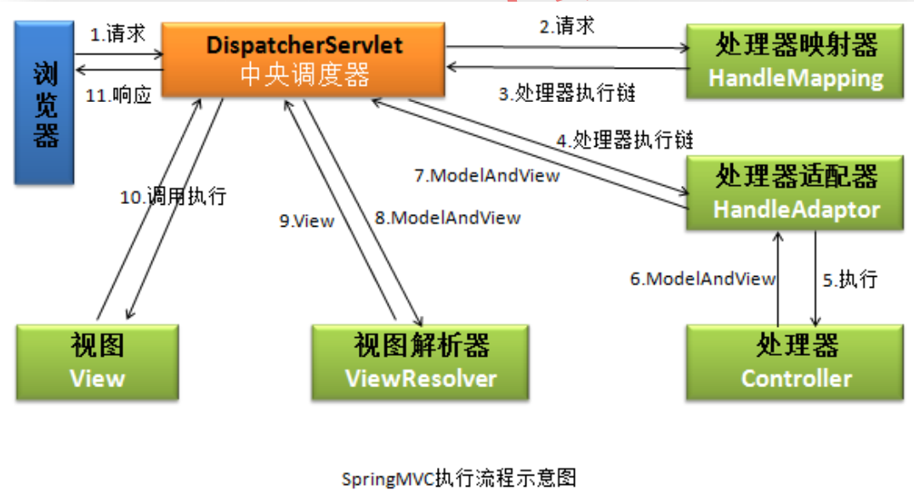

## 事务的传播行为和隔离级别

### 1. 事务的传播属性

事务的传播行为是指，处于不同事务中的方法相互调用时，执行期间事务的维护情况。简单的说，**当一个方法运行在另一个开启事务的方法中，那么当前方法是使用原始事务，还是自己开启一个新的事务，又或者是直接抛出异常等**。Spring提供了7种事务的传播行为，全部以PROPAGATION_XXX形式：

* REQUIRED：指定的方法必须运行在事务中，如果当前存在事务，就是用当前事务；如果不存在事务，则创建一个新的事务。这是Spring默认的事务传播行为；
* REQUIRES_NEW：总是新建一个事务，如果当前存在事务，那么将当前事务先挂起，执行自身开启的事务。执行完毕后，将原来挂起的事务重新开启；
* SUPPORTS：指定的方法支持当前事务，但是如果没有当前事务，那么也可以以非事务的方式运行；
* MANDATORY：指定的方法必须在当前事务中执行，如果没有当前事务，那么直接抛出异常；
* NOT_SUPPORTED：指定的方法不能在事务的环境下执行，若当前存在事务，将当前的事务直接挂起；
* NEVER：指定的放方法不能在事务的环境下执行，若当前存在事务，那么直接抛出异常；
* NESTED：指定的方法必须在事务内执行。若当前没有事务，则创建一个新事务；若当前存在事务，则在嵌套事务内执行；

:star:注意区别PROPAGATION_REQUIRES_NEW和PROPAGATION_NESTED:

* PROPAGATION_REQUIRES_NEW是开启一个新的、完全不依赖原有事务的事务，它拥有自己的隔离级别、锁等资源，也就是说这个新事物的commited或者rolled back都不依赖外部事物。当事务执行时，外部事物会被挂起，该事务执行完毕之后，外部事物才会继续执行
*  PROPAGATION_NESTED是一个已经存在事务的子事务。嵌套事务开始执行时，会取得一个savepoint，如果这个嵌套事务执行失败，那么将会滚到该savepoint。总的来说，**嵌套事务是外部事务的一部分，只有外部事务结束时它才会提交或者回滚**。有一点类似github创建一个新的分支。

```java
ServiceA {      
    /** 
     * 事务属性配置为 PROPAGATION_REQUIRED 
     */  
    void methodA() {  
        ServiceB.methodB();  
    }  
}  
  
ServiceB {     
    /** 
     * 事务属性配置为 PROPAGATION_NESTED 
     */   
    void methodB() {  
    }   
}   

// 修改ServiceA为：
ServiceA {     
    /** 
     * 事务属性配置为 PROPAGATION_REQUIRED 
     */  
    void methodA() {  
        try {  
            /**
             * 当此时methodB()发生异常时，它会回滚到之前的savepoint，而不会产生脏数据
             */
            ServiceB.methodB();  
        } catch (SomeException) {  
            // 执行其他业务, 如 ServiceC.methodC();  
        }  
    }    
}  

```

### 2. 数据库的并发问题

* 脏读：一个事务读取了另一个事务**更新但未提交**的数据，之后另外的事务进行回滚，导致当前事务读到了无效的值。脏读是**针对未提交的情况**
* 不可重复读：针对已经提交的情况，事务A第一次读取的值为A，事务B将该值改成B，导致事务A再次读取该值时为B，两次读取结果不一样
* 幻读：针对已提交的情况，事务A读取表中的一部分数据，事务B向表中插入的新数据，导致事务A再次读取表时读取到新的数据
* :star:注意不可重复读是针对已存在的数据两次读取结果不一样，而幻读是第二次读取到了不存在的数据:star:

### 3. 事务的隔离级别

* 读未提交（READ_UNCOMMITTED）：事务A可以读取事务B未提交的数据，不能解决任何并发问题
* 读已提交（READ_COMMITTED）：事务A可以读取事务B已提交的数据，能够解决脏读，不能解决不可重复度和幻读问题，Oracle的默认隔离级别
* 可重复读（REPEATABLE_READ）：确保事务可以多次从同一字段中读取到相同的值，解决脏读、不可重复读问题，但是不能解决幻读问题，MySQL的默认隔离级别
* 串行化（SERIALIZABLE）：可以确保事务能够多次从同一个表中读取到相同的行，在该事务执行期间，禁止其它事务对该表进行添加、更新、删除操作，可以避免任何并发问题，但是效率极低
* DEFAULT：采用DB的默认事务隔离级别，MySQL默认的隔离级别为可重复读，Oracle默认的隔离级别为读已提交

|                  | 脏读 | 不可重复读 | 幻读 | 补充               |
| ---------------- | ---- | ---------- | ---- | ------------------ |
| READ_UNCOMMITTED | 有   | 有         | 有   | 不能解决任何问题   |
| READ_COMMITTED   | 无   | 有         | 有   | Oracle默认隔离级别 |
| REPEATABLE_READ  | 无   | 无         | 有   | MySQL默认隔离级别  |
| SERIALIZABLE     | 无   | 无         | 无   | 效率极低           |

## 在SpringMVC中POST、GET请求解决中文乱码问题

### 1. POST请求

SpringMVC中提供了一个CharacterEncodingFilter的过滤器，专门用来处理字符编码问题。该类有两个属性：**encoding**和**forceEncoding**，而具体操作实现是由**doFilterInternal**方法完成：

```java
public class CharacterEncodingFilter extends OncePerRequestFilter {
    private String encoding;
    private boolean forceEncoding = false;
    
    public CharacterEncodingFilter() {
    }
    public void setEncoding(String encoding) {
        this.encoding = encoding;
    }
    public void setForceEncoding(boolean forceEncoding) {
        this.forceEncoding = forceEncoding;
    }

    protected void doFilterInternal(HttpServletRequest request, HttpServletResponse response, FilterChain filterChain) throws ServletException, IOException {
        if (this.encoding != null && (this.forceEncoding || request.getCharacterEncoding() == null)) {
            request.setCharacterEncoding(this.encoding);
            if (this.forceEncoding) { // 只有forceEncoding为true才会处理响应字符编码问题
                response.setCharacterEncoding(this.encoding);
            }
        }
        filterChain.doFilter(request, response);
    }
}
```

通过CharacterEncodingFilter解决post中文乱码问题，需要在web.xml中进行过滤器配置：

```xml
<!--spring-mvc过滤器解决字符编码问题-->
<filter>
    <filter-name>characterEncodingFilter</filter-name>
    <filter-class>org.springframework.web.filter.CharacterEncodingFilter</filter-class>
    <init-param>
        <param-name>encoding</param-name>
        <param-value>utf-8</param-value>
    </init-param>
    <init-param>
        <param-name>forceEncoding</param-name>
        <param-value>true</param-value>
    </init-param>
</filter>
<filter-mapping>
    <filter-name>characterEncodingFilter</filter-name>
    <url-pattern>/*</url-pattern> // 拦截所有请求，将对应的编码放在request域中
</filter-mapping>
```

### 2. GET请求

如果是get请求出现中文乱码文集，则需要在tomcat服务器的配置文件apache-tomcat-8.5.42\conf\server.xml中：

```xml
<Connector
    port="8080" protocol="HTTP/1.1"
	connectionTimeout="20000"
	redirectPort="8443"
    URIEncoding="UTF-8" // 加入这一句即可
/>
```

## SpringMVC的工作流程



* 客户端（浏览器）方法请求，直接请求到前端控制器（DispatcherServlet），也叫中央控制器
* DispatcherServlet直接将请求转给了处理器映射器（HandleMapping）
* 处理器映射器根据请求找到能够处理该请求的处理器，并将结果封装为HandlerExecutionChain返回给中央控制器，处理器执行链中包含了所有的处理器拦截器（HandlerIntercepter）和处理器对象（Handler）
* DispatcherServlet根据处理器执行链（HandlerExecutionChain）中的处理器，轮询的方式找到能够执行该处理器的适配器
* 处理器适配器调用真正能够处理该请求的处理器（后端处理器，这个使我们真正自己实现的处理器）
* 处理器将处理结果及要跳转的视图封装成一个ModelAndView对象，并将其返回给处理器适配器
* 处理器适配器直接将ModelAndView结果返回给DispatcherServlet
* DispatcherServlet调用视图解析器，将ModelAndView对象封装成视图对象
* 视图解析器将封装的视图对象返回给DispatcherServlet
* DispatcherServlet调用视图对象，让其自己进行渲染，即数据填充，形成响应对象并返回给中央控制器
* DispatcherServlet将渲染后的视图对象响应给客户端

:star:DispatcherServlet有一个默认配置，对处理器映射器、处理器适配器、视图解析器等进行配置，它们放在对应spring-mvc jar包中的org.springframework.web.servlet包下的**DispatcherServlet.properties**文件中

```properties
# 处理器映射器的默认配置
org.springframework.web.servlet.HandlerMapping=
		org.springframework.web.servlet.handler.BeanNameUrlHandlerMapping,\
		org.springframework.web.servlet.mvc.annotation.DefaultAnnotationHandlerMapping
# 处理器适配器的默认配置
org.springframework.web.servlet.HandlerAdapter=
		org.springframework.web.servlet.mvc.HttpRequestHandlerAdapter,\
		org.springframework.web.servlet.mvc.SimpleControllerHandlerAdapter,\
		org.springframework.web.servlet.mvc.annotation.AnnotationMethodHandlerAdapter
# 视图解析器的默认配置
org.springframework.web.servlet.ViewResolver=
		org.springframework.web.servlet.view.InternalResourceViewResolver
```

:star:DispatcherServlet的配置：

```xml
<servlet>
    <servlet-name>springmvc</servlet-name>
    <servlet-class>org.springframework.web.servlet.DispatcherServlet</servlet-class>
    <!-- 如果不设置init-param标签，则必须在/WEB-INF/下创建xxx-servlet.xml文件，其中xxx是servlet-name中配置的名称。 -->
    <init-param>
        <param-name>contextConfigLocation</param-name>
        <param-value>classpath:resources/spring-mvc.xml</param-value>
    </init-param>
    <load-on-startup>1</load-on-startup>
</servlet>
<servlet-mapping>
    <servlet-name>springmvc</servlet-name>
    <url-pattern>*.do</url-pattern>
</servlet-mapping>

<!--指定spring配置文件及名称-->
<context-param>
    <param-name>contextConfigLocation</param-name>
    <param-value>classpath:resources/spring-*.xml</param-value>
</context-param>

<!--spring注册ServletContext监听器-->
<!--在ServletContext初始化时完成Spring容器的创建，而不是每次请求都创建容器-->
<!--通过WebApplicationContextUtils.getRequiredWebApplicationContext(this.getServletContext());获取Spring容器-->
<listener>
    <listener-class>org.springframework.web.context.ContextLoaderListener</listener-class>
</listener>
```

## MyBatis实体类中属性名和DB中字段名不一致

MyBatis实体类中定义的属性名可能和数据库表中字段名称不一致时，通常有两种解决方案，还有一种不常用：

* 查询时候起别名：将last_name起别名为lastName

```xml
<!-- 在mapper文件中 -->
<select id="getStudentById" resultType="nwpu.sherman.beans.Student">
  select id, last_name as lastName from student where id = #{id}
</select>
```

* 使用resultMap

```xml
<!--在mapper文件中-->
<select id="getStudentById" resultMap="myMap">
select * from student where id= #{id}
</select>
<resultMap type="nwpu.sherman.beans.Student" id="myMap">
  <!--映射主键-->
  <id column="id" property="id"/>
  <!--映射其它列-->
  <result column="last_name" property="lastName"/>
</resultMap>
```

* 将下划线形式命名规则改成驼峰式命名规则

```xml
<!--在MyBatis的主配置文件中加入-->
<settings>
    <setting name="mapUnderscoreToCamelCase" value="true"/>
</settings>
```
