## 面试第二季

> [TOC]

### 一、 volatile关键字理解
volatile是Java提供的轻量级的同步机制，主要有三个特性：
> 1. 保证内存可见性
> 2. 不保证原子性
> 3. 禁止指令重排序

#### 1.1 保证内存可见性

当某个线程在自己的工作内存中将主内存中共享数据的副本修改并刷新到主内存后，其它线程能够立即感知到该共享数据发生变化：

```java
/**
 * Volatile关键字：【内存可见性】
 * - 使用语句（1），注释语句（2） -> 程序一直等待
 * - 使用语句（2），注释语句（1） -> 程序正常结束
 *
 * @author sherman
 */
public class VolatileMemoryVisibility {
    //private int i;            // （1）
    private volatile int i;     // （2）

    public void changeI() {
        this.i = 100;
    }

    public static void main(String[] args) {
        VolatileMemoryVisibility vd = new VolatileMemoryVisibility();
        new Thread(() -> {
            try {
                Thread.sleep(1000);
            } catch (InterruptedException e) {
                e.printStackTrace();
            }
            vd.changeI();
            System.out.println("子线程改变了i的值！");
        }).start();

        while (vd.i == 0) {
        }
        System.out.println("main线程感知到i的变化!");
    }
}
```

#### 1.2 不保证原子性

不保证原子性正是volatile轻量级的体现，多个线程对volatile修饰的变量进行操作时，会出现容易出现**写覆盖**的情况（i++）：

```java
/**
 * Volatile关键字：【内存可见性】
 * - 使用语句（1），注释语句（2） -> 程序一直等待
 * - 使用语句（2），注释语句（1） -> 程序正常结束
 *
 * @author sherman
 */
public class VolatileMemoryVisibility {
    //private int i;            // （1）
    private volatile int i;     // （2）

    public void changeI() {
        this.i = 100;
    }

    public static void main(String[] args) {
        VolatileMemoryVisibility vd = new VolatileMemoryVisibility();
        new Thread(() -> {
            try {
                Thread.sleep(1000);
            } catch (InterruptedException e) {
                e.printStackTrace();
            }
            vd.changeI();
            System.out.println("子线程改变了i的值！");
        }).start();

        while (vd.i == 0) {
        }
        System.out.println("main线程感知到i的变化!");
    }
}
```

#### 1.3 禁止指令重排序

计算机执行程序为了提高性能，编译器和处理器常常会进行指令重排。源代码 -> 编译器优化重排 -> 指令并行重排 -> 内存系统重排 -> 最终执行指令。单线程环境下程序最终执行结果和执行顺序结果一致，多线程环境下线程交替执行，由于编译器优化重排的存在，两个线程使用的变量一致性无法保证。处理器在进行指令重排的时候必须考虑指令之间的数据依赖性。volatile能够实现禁止指令重排的底层原理：

- 内存屏障（Memory Barrier）：它是一个CPU指令。由于编译器和CPU都能够执行指令重排，如果在指令间插入一条**Memory Barrier**则会告诉编译器和CPU，任何指令都不能和该条Memory Barrier指令进行重排序，即通过插入内存屏障指令能够禁止在内存屏障前后的指令执行重排序优化。
- 内存屏障的另外一个作用是强制刷新各种CPU的缓存数据，因此任何CPU上的线程都能够读取到这些数据的最新版本。以上两点正好对应了volatile关键字的禁止指令重排序和内存可见性的特点。
- 对volatile变量进行写操作时，会在写操作之后加入一条store屏障指令，将工作内存中的共享变量copy刷新回主内存中；对volatile变量进行读操作时，会在读操作之前加入一条load的屏障指令，从主内存中读取共享变量。

```java
/**
 * Volatile关键字：【禁止指令重排序】
 * 高并发环境下DCL（Double Check Lock）单例模式使用volatile防止指令重排序
 *
 * @author sherman
 */
public class VolatileForbidRearrange {
    /**
     * 对INSTANCE使用volatile可以防止下面3条语句发生指令重排变成:1 -> 3 -> 2
     * 多线程环境下：当发生指令重排时, 进行到第3条语句时, INSTANCE != null但是该内存仅仅是原始内存
     * 对象并没有在该原始内存上初始化, 该方法直接return INSTANCE导致当前线程拿到一个非null但是未初始化
     * 的对象。如果在该内存上进行相应的访问对象数据操作就会出错
     */
    private static volatile VolatileForbidRearrange INSTANCE = null;

    private VolatileForbidRearrange() {
    }

    public static VolatileForbidRearrange getInstance() {

        if (INSTANCE == null) {
            synchronized (VolatileForbidRearrange.class) {
                if (INSTANCE == null) {
                    // 以下语句实际等同于3条语句：
                    // 1. rawMemory = memoryAllocate();     // 开辟原始内存
                    // 2. instance(rawMemory);              // 在原始内存上对对象初始化
                    // 3. 将rawMemory的地址赋值给INSTANCE, 此时INSTANCE != null
                    INSTANCE = new VolatileForbidRearrange();
                }
            }
        }
        return INSTANCE;
    }
}
```

#### 1.4 volatile使用场景

- 高并发环境下DCL单例模式使用volatile，见上面示例
- JUC包下**AtomicXxx类**：原子类AtomicXxx中都有一个成员变量value，该**value**变量被声明为volatile，保证AtomicXxx类的内存可见性，而原子性由CAS算法&Unsafe类保证，结合这两点才能让AtomicXxx类很好地替代synchronized
关键字。
```java
public class AtomicInteger extends Number implements java.io.Serializable {
    // ...
    private volatile int value;
    // ...
}
```

### 二、Java内存模型（JMM）

#### 2.1 JMM概念

JMM是一种抽象的概念并不真实存在，描述的是一组规范，定义了Java各个变量（实例字段、静态字段、构成数据的元素）的访问形式。JMM多线程编程情况下需要保证：内存可见性、原子性、有序性，**volatile不满足JMM的原子性**。JMM同步规定：
- 线程加锁之前，必须**读取**主内存中的值到线程私有的工作内存中
- 线程解锁之前，必须将线程各自工作内存中的值**刷新**回主内存中
- 加锁和解锁必须是**同一把锁**

#### 2.2 JMM工作流程

JMM规定所有的变量都存储在主内存中（即计算机的内存条，16g内存），即主内存是共享区域。而每个线程创建时，JVM都会为其创建一个工作内存，工作内存是每个线程私有的数据区域，不同线程之间无法访问对方的工作空间，线程间通信需要借助到主内存。各个线程对数据的操作（读取）都是在各自的工作内存中完成的：

- 首先将主内存中的变量copy到各自的工作内存
- 完成操作之后，在将各自工作内存中的变量刷新回主内存空间，而不是每个线程在主内存空间直接操作共享数据

### 三、CAS算法
CAS（Compare And Swap）算法是一条原子的CPU指令（Atomic::cmpxchg(x, addr, e) == e;），需要三个操作数：变量的内存地址（或者是偏移量valueOffset） **V** ，预期值 **A** 和更新值 **B**，CAS指令执行时：

**当且仅当对象偏移量V上的值和预期值A相等时，才会用更新值B更新V内存上的值，否则不执行更新。但是无论是否更新了V内存上的值，最终都会返回V内存上的旧值。**

#### 3.1 为什么使用CAS代替synchronized

synchronized加锁，同一时间段只允许一个线程访问，能够保证一致性但是并发性下降。而是用CAS算法使用do-while不断判断而没有加锁（实际是一个自旋锁），保证一致性和并发性。

- 原子性保证：CAS算法依赖于rt.jar包下的**sun.misc.Unsafe**类，该类中的所有方法都是native修饰的，直接调用操作系统底层资源执行相应的任务。
```java
// unsafe.class
public final int getAndAddInt(Object var1, long var2, int var4) {
    int var5;
    do {
        // 获取对象var1，偏移量为var2地址上的值，并赋值给var5
        var5 = this.getIntVolatile(var1, var2);
        /**
         * 再次获取对象var1，偏移量var2地址上的值，并和var5进行比较：
         * - 如果不相等，返回false，继续执行do-while循环
         * - 如果相等，将返回的var5数值和var4相加并返回
         */
    } while(!this.compareAndSwapInt(var1, var2, var5, var5 + var4));
    // 最终总是返回对象var1，偏移量为var2地址上的值，即上述所说的V。
    return var5;
}
```
- 内存可见性和禁止指令重排序的保证：AtomicXxx类中的成员变量value是由volatile修饰的：private volatile int value;上一小节中已经介绍过。

#### 3.2 CAS算法的缺点
- do-while循环，如果CAS失败就会一直进行尝试，即一直在自旋，导致CPU开销，这也是自旋锁的缺点；
- 只能保证一个共享变量的原子操作，如果操作多个共享变量则需要加锁实现；
- :star:ABA问题：如果一个线程在初次读取时的值为A，并且在准备赋值的时候检查该值仍然是A，但是可能在这两次操作
之间，有另外一个线程现将变量的值改成了B，然后又将该值改回为A，那么CAS会误认为该变量没有变化过。

#### 3.3 ABA问题解决方案

可以使用AtomicStampedReference或者AtomicMarkableReference来解决CAS的ABA问题，思路类似于SVN版本号，SpringBoot热部署中trigger.txt
思路：

- AtomicStampedReference解决方案：每次修改都会让**stamp**值加1，类似于版本控制号
```java
/**
 * ABA问题解决方案，AtomicStampedReference
 *
 * @author sherman
 */
public class AtomicStampedReferenceABA {
    private static AtomicReference<Integer> ar = new AtomicReference<>(0);
    private static AtomicStampedReference<Integer> asr =
            new AtomicStampedReference<>(0, 1);

    public static void main(String[] args) {
        System.out.println("=============演示ABA问题（AtomicReference）===========");
        new Thread(() -> {
            ar.compareAndSet(0, 1);
            try {
                Thread.sleep(1000);
            } catch (InterruptedException e) {
                e.printStackTrace();
            }
            ar.compareAndSet(1, 0);
            System.out.println(Thread.currentThread().getName() + "进行了一次ABA操作");
        }, "子线程").start();

        try {
            Thread.sleep(5000);
        } catch (InterruptedException e) {
            e.printStackTrace();
        }

        boolean res = ar.compareAndSet(0, 100);
        if (res) {
            System.out.println("main成功修改, 未察觉到子线程进行了ABA操作");
        }

        System.out.println("=============解决ABA问题（AtomicStampReference）===========");
        new Thread(() -> {
            int curStamp = asr.getStamp();
            System.out.println("当前stamp: " + curStamp);
            try {
                Thread.sleep(1000);
            } catch (InterruptedException e) {
                e.printStackTrace();
            }
            asr.compareAndSet(0, 1, curStamp, curStamp + 1);
            try {
                Thread.sleep(1000);
            } catch (InterruptedException e) {
                e.printStackTrace();
            }
            asr.compareAndSet(1, 0, asr.getStamp(), asr.getStamp() + 1);
        }, "t1").start();

        new Thread(() -> {
            int curStamp = asr.getStamp();
            System.out.println("当前stamp: " + curStamp);
            try {
                Thread.sleep(5000);
            } catch (InterruptedException e) {
                e.printStackTrace();
            }
            boolean result = asr.compareAndSet(0, 100, curStamp, curStamp + 1);
            if (!result) {
                System.out.println("修改失败! 预期stamp: " + curStamp + ", 实际stamp: " + asr.getStamp());
            }
        }, "t2").start();
    }
}
```
- AtomicMarkableReference：如果不关心引用变量中途被修改了多少次，而只关心是否被修改过，可以使用AtomicMarkableReference：
```java
/**
 * ABA问题解决方案，AtomicMarkableReference
 *
 * @author sherman
 */
public class AtomicMarkableReferenceABA {
    private static AtomicMarkableReference<Integer> amr = new AtomicMarkableReference<>(0, false);

    public static void main(String[] args) {
        new Thread(() -> {
            amr.compareAndSet(0, 1, false, true);
            try {
                Thread.sleep(1000);
            } catch (InterruptedException e) {
                e.printStackTrace();
            }
            amr.compareAndSet(1, 0, true, true);
            System.out.println("子线程进行了ABA修改!");
        }, "子线程").start();

        try {
            Thread.sleep(3000);
        } catch (InterruptedException e) {
            e.printStackTrace();
        }

        boolean res = amr.compareAndSet(0, 100, false, true);
        if (!res) {
            System.out.println("修改失败! 当前isMarked: " + amr.isMarked());
        }
    }
}
```

#### 3.3 补充：CAS算法实际使用

在Spring容器刷新方法 **refresh()** 方法中：obtainFreshBeanFactory()->refreshBeanFactory()【GenericApplicationContext实现类】:
```java
@Override
protected final void refreshBeanFactory() throws IllegalStateException {
    // cas算法
    // private final AtomicBoolean refreshed = new AtomicBoolean();
    if (!this.refreshed.compareAndSet(false, true)) {
        throw new IllegalStateException(
                "GenericApplicationContext does not support multiple refresh attempts: just call 'refresh' once");
    }
    this.beanFactory.setSerializationId(getId());
}
```

### 四、集合类并发异常
Java普通集合类一般情况下都是线程不安全的，没有加锁实现，抛出并发异常主要是由两个变量**modCount** 和 **expectedModCount** 不匹配造成的。

#### 4.1 ArrayList线程安全问题

ArrayList是线程不安全的，add()方法并没有加锁（synchronized），多线程环境下会抛出ConcurrentModificationException：
```java
public class ArrayListConcurrentDemo {
    public static void main(String[] args) {
        List<String> list = new ArrayList<>();
        for (int i = 0; i < 30; ++i) {
            new Thread(() -> {
                list.add(UUID.randomUUID().toString().substring(0, 4));
                System.out.println(list);
            }).start();
        }
    }
}
```

**解决方案**：

- 使用Vector类（使用了synchronized），效率极低
- 使用Collections.synchronizedList(new ArrayList<>())：内部直接将接受的List对象传递给静态内部类**SynchronizedList**对象，然后
Collections.synchronizedList(new ArrayList<>())返回的List对象的调用方法都是直接调用输入List对象的方法，但是加了synchronized，类似装饰器模式，也是对输入List的一种增强：
```java
static <T> List<T> synchronizedList(List<T> list, Object mutex) {
    return (list instanceof RandomAccess ?
            new SynchronizedRandomAccessList<>(list, mutex) :
            new SynchronizedList<>(list, mutex));
}

static class SynchronizedList<E>
    extends SynchronizedCollection<E>
    implements List<E> {
    private static final long serialVersionUID = -7754090372962971524L;

    final List<E> list;

    SynchronizedList(List<E> list) {
        super(list);
        this.list = list;
    }
    SynchronizedList(List<E> list, Object mutex) {
        super(list, mutex);
        this.list = list;
    }

    public boolean equals(Object o) {
        if (this == o)
            return true;
        synchronized (mutex) {return list.equals(o);}
    }
    public int hashCode() {
        synchronized (mutex) {return list.hashCode();}
    }

    public E get(int index) {
        synchronized (mutex) {return list.get(index);}
    }
    public E set(int index, E element) {
        synchronized (mutex) {return list.set(index, element);}
    }
    public void add(int index, E element) {
        synchronized (mutex) {list.add(index, element);}
    }
    public E remove(int index) {
        synchronized (mutex) {return list.remove(index);}
    }

    public int indexOf(Object o) {
        synchronized (mutex) {return list.indexOf(o);}
    }
    public int lastIndexOf(Object o) {
        synchronized (mutex) {return list.lastIndexOf(o);}
    }

    public boolean addAll(int index, Collection<? extends E> c) {
        synchronized (mutex) {return list.addAll(index, c);}
    }

    public ListIterator<E> listIterator() {
        return list.listIterator(); // Must be manually synched by user
    }

    public ListIterator<E> listIterator(int index) {
        return list.listIterator(index); // Must be manually synched by user
    }

    public List<E> subList(int fromIndex, int toIndex) {
        synchronized (mutex) {
            return new SynchronizedList<>(list.subList(fromIndex, toIndex),
                                        mutex);
        }
    }

    @Override
    public void replaceAll(UnaryOperator<E> operator) {
        synchronized (mutex) {list.replaceAll(operator);}
    }
    @Override
    public void sort(Comparator<? super E> c) {
        synchronized (mutex) {list.sort(c);}
    }

    private Object readResolve() {
        return (list instanceof RandomAccess
                ? new SynchronizedRandomAccessList<>(list)
                : this);
    }
}
```
- :star:CopyOnWriteArrayList：写时复制是一种读写分离的思想，在并发读的时候不需要加锁，因为它能够保证并发读的情况下不会添加任何元素。而在并发写的情况下，需要先加锁，但是并不直接对当前容器进行写操作。而是先将当前容器进行复制获取一个新的容器，进行完并发写操作之后，当之前指向原容器的引用更改指向当前新容器。也就是说，**并发读和并发写是针对不同集合，因此不会产生并发异常**
```java
// CopyOnWriteArrayList.java
public boolean add(E e) {
    // 写操作加锁
    final ReentrantLock lock = this.lock;
    lock.lock();
    try {
        // 原有容器复制一份
        Object[] elements = getArray();
        int len = elements.length;
        // 创建一个容器，将原来的数据复制到新容器中，并且还有一个位置空余
        Object[] newElements = Arrays.copyOf(elements, len + 1);
        // 将新元素添加到空余位置
        newElements[len] = e;
        // 将原来指向旧容器的引用指向新容器
        setArray(newElements);
        return true;
    } finally {
        // 写操作完成，解锁
        lock.unlock();
    }
}

public E set(int index, E element) {
    // 更新操作类似
    final ReentrantLock lock = this.lock;
    lock.lock();
    try {
        Object[] elements = getArray();
        E oldValue = get(elements, index);

        if (oldValue != element) {
            int len = elements.length;
            Object[] newElements = Arrays.copyOf(elements, len);
            newElements[index] = element;
            setArray(newElements);
        } else {
            // Not quite a no-op; ensures volatile write semantics
            setArray(elements);
        }
        return oldValue;
    } finally {
        lock.unlock();
    }
}

// 读操作不加锁
private E get(Object[] a, int index) {
    return (E) a[index];
}
```

#### 4.2 HashSet线程安全问题

HashSet底层就是一个HashMap，默认的HashSet是一个初始大小为16，负载因子为0.75的HashMap:
```java
/**
 * Constructs a new, empty set; the backing <tt>HashMap</tt> instance has
 * default initial capacity (16) and load factor (0.75).
 */
public HashSet() {
    map = new HashMap<>();
}

// Dummy value to associate with an Object in the backing Map
private static final Object PRESENT = new Object();

public boolean add(E e) {
    return map.put(e, PRESENT)==null;
}
```

所以**HashSet的多线程安全问题实际上就是HashMap的多线程安全问题**：
```java
/**
 * HashSet多线程不安全问题
 * HashSet底层就是HashMap，因此这个案例也是HashMap多线程不安全问题的演示
 *
 * @author sherman
 */
public class HashSetThreadUnsafe {
    public static void main(String[] args) {
        Set<String> sets = new HashSet<>();
        for (int i = 0; i < 100; ++i) {
            new Thread(() -> {
                sets.add(UUID.randomUUID().toString().substring(0, 4));
                System.out.println(sets);
            }).start();
        }
    }
}
```

**解决方案**：
- Collections集合类的static方法SynchronizedSet
- CopyOnWriteArraySet：也是写时复制思想，但是内部还是使用**CopyOnWriteArrayList**实现：
```java
public class CopyOnWriteArraySet<E> extends AbstractSet<E>
        implements java.io.Serializable {
    private static final long serialVersionUID = 5457747651344034263L;

    private final CopyOnWriteArrayList<E> al;

    /**
     * Creates an empty set.
     */
    public CopyOnWriteArraySet() {
        // 构造器内部实例化了一个CopyOnWriteArrayList
        al = new CopyOnWriteArrayList<E>();
    }
    // ...
}
```

#### 4.3 HashMap多线程安全的解决方案

相比于HashSet，HashMap除了可以使用Collections集合类的synchronizedMap方法外，还可以使用
juc包下ConcurrentHashMap类。


### 五、Java多线程锁

#### 5.1 公平锁和非公平锁
- 定义：
    - 公平锁：多个线程按照申请锁的顺序来获取锁，按照FIFO规则从等待队列中拿到等待线程获取相应锁
    - 非公平锁：多个线程并不是按照申请锁的顺序来获取锁，有可能出现后申请锁的线程先申请到锁。在高
    并发环境下，非公平锁有可能造成 **优先级反转** 或者 **饥饿** 的现象。如果非公平锁抢占失败，就要继续采取类似公平锁的机制。非公平锁的优点在于吞吐量大。
- 常见的非公平锁：
    - ReentrantLock可以通过指定构造函数的boolean类型来获取公平/非公平锁，默认情况下是非公平锁
    - 对于Synchronized而言，也是一种非公平锁

#### 5.2 可重入锁（递归锁）
- 定义：可重入锁的定义要类比递归的定义来理解。指在同一个线程外层函数获得锁之后，内层递归函数仍然能够获取该锁的代码，
即进入内层函数时会自动获取锁。也就是说，线程可以进入任何一个它已经拥有的锁所同步的代码块。一个同步方法内部仍然存在一个同步方法，那么可以进入内层同步方法，且内存同步方法和外层同步方法持有的是同一把锁。

具体看一个案例来理解可重入锁：synchronized就是可重入锁，现在问题是synchronized块中能够使用System.out.println()方法？
```java
public void println(String x) {
    // println方法内部使用了synchronized
    synchronized (this) {
        print(x);
        newLine();
    }
}

/**
 * 演示可重入锁
 *
 * @author sherman
 */
public class LockReentrantDemo1 {
    public static void main(String[] args) {
        // 程序正常运行输出：hello
        new LockReentrantDemo1().lockReentrant();
    }

    public synchronized void lockReentrant() {
        /**
         * 注意这个println方法内部就使用了synchronized关键字，锁住了this
         * 即synchronized块中仍然能够使用synchronized关键字 -> 可重入的
         */
        System.out.println("hello");
    }
}
```
可重入锁的意义有一点类似于事务的传播行为（一个方法运行在另一个开启事务的方法中，那么当前方法的事务行为是什么样的？），类比来说可重入锁意义就是：一个synchronized（锁）块运行在另一个synchronized（块）中，那么当前synchronized的具体表现行为是什么，是直接中断？还是阻塞等待？又或者是正常执行，因为两个synchronized锁住的是同一个对象？

可重入锁的含义就是最后一种：正常执行，因为可重入锁，锁的是同一个对象。

- 典型的可重入锁：ReentrantLock & synchronized关键字
- 作用：最大作用就是防止死锁，因为多层嵌套的锁，其实锁的是同一个对象，另一个含义就是：嵌套方法持有的是同一把锁

**具体示例**：
```java
/**
 * 可重入锁演示
 *
 * @author sherman
 */
// 演示ReentrantLock是可重入的
class ShareResouce implements Runnable {
    private Lock lock = new ReentrantLock();

    @Override
    public void run() {
        get();
    }

    private void get() {
        lock.lock();
        try {
            lock.lock();
            System.out.println(Thread.currentThread().getName() + ": get()");
            set();
        } finally {
            lock.unlock();
        }
    }

    private void set() {
        lock.lock();
        try {
            lock.lock();
            System.out.println(Thread.currentThread().getName() + ": set()");
        } finally {
            lock.unlock();
        }
    }
}

public class LockReentrantDemo2 {
    // outer()和inner()方法演示synchronized是可重入的
    private synchronized void outer() {
        System.out.println(Thread.currentThread().getName() + ": outer method()");
        inner();
    }

    // outer()和inner()方法演示synchronized是可重入的
    private synchronized void inner() {
        System.out.println(Thread.currentThread().getName() + ": inner method()");
    }

    public static void main(String[] args) {
        // 验证synchronized是可重入的
        LockReentrantDemo2 lrd = new LockReentrantDemo2();
        new Thread(lrd::outer, "thread-1").start();
        new Thread(lrd::outer, "thread-2").start();
        try {
            Thread.sleep(1000);
        } catch (InterruptedException e) {
            e.printStackTrace();
        }
        // 验证ReentrantLock是可重入的
        System.out.println("===================");
        new Thread(new ShareResouce(), "thread-3").start();
        new Thread(new ShareResouce(), "thread-4").start();
    }
}
```
**补充**：

在使用ReentrantLock类演示可重入锁时，lock.lock()和lock.unlock()数量一定要匹配，否则：
- 当lock.lock()数量 > lock.unlock()：程序一直运行
- 当lock.lock()数量 < lock.unlock()：抛出**java.lang.IllegalMonitorStateException**异常

#### 5.3 自旋锁（SpinLock）
自旋锁尝试获取锁的线程不会立即阻塞，而是采用循环的方式去尝试获取锁，这样的好处是避免线程上下文切换的消耗，缺点是如果一直自旋会消耗CPU：

```java
/**
 * 自旋锁演示
 *
 * @author sherman
 */
public class LockSpin {
    AtomicReference<Thread> ar = new AtomicReference<>();

    private void lock() {
        Thread thread = Thread.currentThread();
        System.out.println(thread.getName() + ": come in!");
        while (!ar.compareAndSet(null, thread)) {

        }
    }

    private void unlock() {
        Thread thread = Thread.currentThread();
        ar.compareAndSet(thread, null);
        System.out.println(thread.getName() + ": get out!");
    }

    public static void main(String[] args) throws InterruptedException {
        LockSpin lockSpin = new LockSpin();
        new Thread(() -> {
            lockSpin.lock();
            try {
                Thread.sleep(8000);
            } catch (InterruptedException e) {
                e.printStackTrace();
            }
            lockSpin.unlock();
        }, "线程A").start();

        // 保证线程A先进行获取到锁，让线程B之后自旋
        Thread.sleep(1000);

        new Thread(() -> {
            lockSpin.lock();
            lockSpin.unlock();
        }, "线程B").start();
    }
}
```

#### 5.4 读写锁
- 写锁（独占锁）：指该锁一次只能被一个线程所持有，ReentrantLock和Synchronized都是独占锁
- 读锁（共享锁）：指该锁可以被多个线程所持有
- 读锁的共享锁可保证并发读是非常高效的，读写、写读、写写的过程都是互斥的
```java

/**
 * 演示读写锁
 *
 * @author sherman
 */
class Cache {
    private volatile HashMap<String, Object> map = new HashMap<>();
    private ReentrantReadWriteLock lock = new ReentrantReadWriteLock();

    public Object get(String key) {
        lock.readLock().lock();
        Object res = null;
        try {
            System.out.println(Thread.currentThread().getName() + ": 正在读取+++");
            Thread.sleep(100);
            res = map.get(key);
            System.out.println(Thread.currentThread().getName() + ": 读取完成---");
        } catch (InterruptedException e) {
            e.printStackTrace();
        } finally {
            lock.readLock().unlock();
        }
        return res;
    }

    public void put(String key, Object value) {
        lock.writeLock().lock();
        try {
            System.out.println(Thread.currentThread().getName() + ": 正在写入>>>");
            Thread.sleep(1000);
            map.put(key, value);
            System.out.println(Thread.currentThread().getName() + "：写入完成<<<");
        } catch (InterruptedException e) {
            e.printStackTrace();
        } finally {
            lock.writeLock().unlock();
        }
    }
}

public class LockReadWrite {
    public static void main(String[] args) {
        Cache cache = new Cache();

        // 写入操作是被一个线程独占的，一旦写线程开始
        // 其它线程必须等待其完成后才能继续执行
        for (int i = 0; i < 10; i++) {
            final int tmp = i;
            new Thread(() -> cache.put(tmp + "", tmp + ""), String.valueOf(i)).start();
        }

        // 读操作可以被多个线程持有
        // 其它线程不必等待当前读操作完成才操作
        for (int i = 0; i < 10; i++) {
            final int tmp = i;
            new Thread(() -> cache.get(tmp + ""), String.valueOf(i)).start();
        }
    }
}
```

#### 5.5 CountDownLatch
CountDownLatch是一个计数器闭锁，它通过一个初始化定时器**latch**，在latch的值被减到0之前，其它线程都会被await()方法阻塞。

以模拟火箭发射过程解释CountDownLatch使用：
```java
/**
 * CountDownLatch模拟火箭发射过程：
 * 火箭发射之前需要十个线程进行前期检查工作，每个线程耗时0-4s，
 * 只有10个线程对应的检查工作全部完成后，火箭才能发射
 *
 * @author sherman
 */

public class CountDownLatchDemo implements Runnable {
    public static final int TASK_NUMBERS = 10;
    private static CountDownLatch cdl = new CountDownLatch(TASK_NUMBERS);

    public static void main(String[] args) throws InterruptedException {
        CountDownLatchDemo countDownLatchDemo = new CountDownLatchDemo();
        ExecutorService executorService = Executors.newFixedThreadPool(10);
        for (int i = 0; i < 10; i++) {
            executorService.submit(countDownLatchDemo);
        }
        cdl.await();
        System.out.println("检查工作检查完毕：fire!");
        executorService.shutdown();
    }

    @Override
    public void run() {
        try {
            // 模拟火箭发射前的各种检查工作
            int millis = new Random().nextInt(5000);
            Thread.sleep(millis);
            System.out.println(Thread.currentThread().getName() + "：检查完毕! 耗时：" + millis + "ms");
        } catch (InterruptedException e) {
            e.printStackTrace();
        } finally {
            // 每次检查完毕后都将计数器减1
            cdl.countDown();
        }
    }
}
```

#### 5.6 CyclicBarrier
CyclicBarrier是可循环使用的屏障，它的功能是：让一组线程到达一个屏障（同步点）时被阻塞，直到最后一个线程到达屏障时，屏障才会被打开，所有被屏障阻塞的方法都会被打开。

A synchronization aid that allows a set of threads to all wait for each other to reach a **common
barrier point**. CyclicBarriers are useful in programs involving a fixed sized party of threads that
must occasionally wait for each other. The barrier is called cyclic because it can be **re-used** 
after the waiting threads are released.

**示例**：模拟集齐七颗龙珠才能召唤神龙：

```java
/**
 * CyclicBarrier模拟集齐七颗龙珠才能召唤神龙
 * 设置common barrier point为7，每个线程收集到七颗龙珠之前都会被阻塞
 * 每个线程都到达common barrier point时候才会召唤神龙
 *
 * @author sherman
 */
public class CyclicBarrierDemo implements Runnable {
    private static CyclicBarrier cb = new CyclicBarrier(7, () -> System.out.println("召唤神龙"));

    @Override
    public void run() {
        try {
            System.out.println(Thread.currentThread().getName() + ": 到达同步点（收集到一个龙珠）!");
            cb.await();
            System.out.println(Thread.currentThread().getName() + ": 阻塞结束，继续执行!");
        } catch (Exception e) {
            e.printStackTrace();
        }
    }

    public static void main(String[] args) {
        CyclicBarrierDemo cbd = new CyclicBarrierDemo();
        ExecutorService executorService = Executors.newFixedThreadPool(7);
        for (int i = 0; i < 7; i++) {
            try {
                Thread.sleep(new Random().nextInt(2000));
            } catch (InterruptedException e) {
                e.printStackTrace();
            }
            executorService.submit(cbd);
        }
        executorService.shutdown();
    }
}
```

#### 5.7 Semaphore
Semaphore信号量主要有两个目的：
- 用于多个共享资源的互斥使用；
- 用于并发数量的控制（是synchronized的加强版，当并发数量为1时就退化成synchronized）；

主要方法：
- Semaphore(int permits)：构造函数，允许控制的并发数量；
- acquire()：请求一个信号量，导致信号量的数量减1；
- release()：释放一个信号量，信号量加1；

**示例**：使用Semaphore模拟请车位过程（3个车位，10辆车）：

```java
/**
 * 使用Semaphore模拟抢车位过程（3个车位，10辆车）
 * 任意时刻只有3辆车持有线程
 *
 * @author sherman
 */
public class SemaphoreDemo {
    public static void main(String[] args) {
        // 模拟三个车位，十辆车
        // 任意时刻只有三辆车持有车位
        Semaphore semaphore = new Semaphore(3);
        for (int i = 0; i < 10; i++) {
            new Thread(() -> {
                try {
                    semaphore.acquire();
                    System.out.println(Thread.currentThread().getName() + ": 抢到车位");
                    // 每辆车占有车位[3,8]秒时间
                    Thread.sleep((new Random().nextInt(6) + 3) * 1000);
                    System.out.println(Thread.currentThread().getName() + ": 释放车位");
                } catch (InterruptedException e) {
                    e.printStackTrace();
                } finally {
                    semaphore.release();
                }
            }).start();
        }
    }
}
```

### 六、阻塞队列
阻塞是一个队列，当阻塞队列是空的时候，从队列中获取元素的操作将会被阻塞；当队列满时，往队列中添加元素的操作将会被阻塞。

#### 6.1 BlockingQueue
BlockingQueue让我们不需要关心什么时候需要阻塞线程，什么时候需要唤醒线程:

**实现类**：

- ArrayBlockingQueue:star:：由数组结构组成的有界阻塞队列
- LinkedBlockingQueue:star:：由链表结构组成的有界阻塞（默认大小Integer.MAX_VALUE()）队列
- PriorityBlockingQueue：支持优先级排序的无界阻塞队列
- DelayQueue：使用优先队列实现延迟无界阻塞队列
- SynchronizedQueue:star:：不存储元素的阻塞队列，也即单个元素的队列
- LinkedTransferQueue：由链表结构组成的无界阻塞队列
- LinkedBlockingDeque:star:：由链表结构组成的双向阻塞队列

**四组API**：

- 抛出异常组：
    - add()：当阻塞队列满时，抛出异常
    - remove()：当队列为空时，抛出异常
    - element()：取出队列开头元素
- null&false返回值：
    - offer()：当阻塞队列满时，返回false
    - poll()：当阻塞队列为空时，返回null
    - peek()：返回阻塞队列开头元素，如果队列为空，返回null
- 一直阻塞：
    - put()：当阻塞队列满时，队列会一直阻塞直到队列有数据被拿走或者响应中断
    - take()：当阻塞队列为空时，队列会一直阻塞直到队列中有新数据被放入或者响应中断
- 超时退出：
    - offer(e, time, unit)：当阻塞队列满时，会阻塞生产者线程一段时间，超出时间限制后生产者线程退出
    - poll(time, unit)：当阻塞队列为空时，会阻塞消费者线程一段时间，超出时间限制后消费者线程退出

#### 6.2 SynchronizedQueue
与其它BlockingQueue不同，SynchronizedQueue是一个不存储元素的BlockingQueue，每一个put操作必须等待一个take操作，否则就不能继续添加元素，反之亦然。总之，**SynchronizedQueue，生产一个，消费一个**。

**示例**：

使用SynchronizedQueue完成生产者-消费者模式，并且该生产者-消费者模式必须是严格生产一个，消费一个：
```java
/**
 * 使用SynchronizedQueue完成生产者-消费者模型，并且是严格生产一个——消费一个
 *
 * @author sherman
 */
public class SynchronizedQueueDemo {
    private static BlockingQueue<String> bq = new SynchronousQueue<>();

    public static void main(String[] args) {
        new Thread(() -> {
            for (int i = 0; i < 10; ++i) {
                final int tmp = i;
                try {
                    System.out.println("生产者线程: " + tmp);
                    bq.put(String.valueOf(tmp));
                } catch (InterruptedException e) {
                    e.printStackTrace();
                }
            }
        }).start();

        new Thread(() -> {
            for (int i = 0; i < 10; i++) {
                final int tmp = i;
                try {
                    Thread.sleep(new Random().nextInt(2000));
                    System.out.println("消费者线程：" + tmp);
                    bq.take();
                } catch (InterruptedException e) {
                    e.printStackTrace();
                }
            }
        }).start();
    }
}
```

#### 6.3 三种生产者-消费者实现方式
实现生产者-消费者模型，要注意：
> 1. 线程操作资源类
> 2. 先判断、在执行、最后返回通知
> 3. while替代if防止虚假唤醒

**synchronized-notifyAll-wait实现**：

```java
/**
 * 生产者-消费者实现方式一：使用synchronized-notifyAll-wait
 *
 * @author sherman
 */
public class ConsumerAndProducer01 {
    // produce和consume都有synchronized修饰，不需要使用volatile保证内存可见性
    private int num = 0;

    synchronized public void produce() {

        while (num != 0) {
            try {
                // 禁止生产
                wait();
            } catch (InterruptedException e) {
                e.printStackTrace();
            }
        }
        // 开始生产
        ++num;
        System.out.println(Thread.currentThread().getName() + ": " + num);
        // 返回通知其它所有阻塞的生产者线程
        this.notifyAll();
    }

    synchronized public void consume() {
        while (num == 0) {
            try {
                // 禁止消费
                wait();
            } catch (InterruptedException e) {
                e.printStackTrace();
            }
        }
        // 开始消费
        --num;
        System.out.println(Thread.currentThread().getName() + ": " + num);
        // // 返回通知其它所有阻塞的生产者线程
        this.notifyAll();
    }

    /**
     * 两个生产者、两个消费者
     */
    public static void main(String[] args) {
        ConsumerAndProducer01 cs1 = new ConsumerAndProducer01();
        new Thread(() -> {
            for (int i = 0; i < 5; i++) {
                try {
                    Thread.sleep(100);
                    cs1.produce();
                } catch (InterruptedException e) {
                    e.printStackTrace();
                }
            }
        }, "+++生产者线程AAA").start();

        new Thread(() -> {
            for (int i = 0; i < 5; i++) {
                try {
                    Thread.sleep(100);
                    cs1.produce();
                } catch (InterruptedException e) {
                    e.printStackTrace();
                }
            }
        }, "+++生产者线程BBB").start();

        new Thread(() -> {
            for (int i = 0; i < 5; i++) {
                try {
                    Thread.sleep(200);
                    cs1.consume();
                } catch (InterruptedException e) {
                    e.printStackTrace();
                }
            }
        }, "---消费者线程CCC").start();

        new Thread(() -> {
            for (int i = 0; i < 5; i++) {
                try {
                    Thread.sleep(200);
                    cs1.consume();
                } catch (InterruptedException e) {
                    e.printStackTrace();
                }
            }
        }, "---消费者线程DDD").start();
    }
}
```
**lock(condition)-signalAll-await实现**：

```java
/**
 * 生产者-消费者实现方式二：使用lock(condition)-signalAll-await实现
 *
 * @author sherman
 */
public class ConsumerAndProducer02 {
    private int num = 0;
    private ReentrantLock lock = new ReentrantLock();
    private Condition condition = lock.newCondition();

    public void produce() {
        lock.lock();
        try {
            while (num != 0) {
                try {
                    // 不能生产
                    condition.await();
                } catch (InterruptedException e) {
                    e.printStackTrace();
                }
            }
            // 开始生产
            ++num;
            System.out.println(Thread.currentThread().getName() + ": " + num);
            condition.signalAll();
        } finally {
            lock.unlock();
        }
    }

    public void consume() {
        lock.lock();
        try {
            while (0 == num) {
                try {
                    // 不能消费
                    condition.await();
                } catch (InterruptedException e) {
                    e.printStackTrace();
                }
            }
            // 开始消费
            --num;
            System.out.println(Thread.currentThread().getName() + ": " + num);
            condition.signalAll();
        } finally {
            lock.unlock();
        }
    }

    /**
     * 两个生产者、两个消费者
     */
    public static void main(String[] args) {
        ConsumerAndProducer02 cs2 = new ConsumerAndProducer02();
        new Thread(() -> {
            for (int i = 0; i < 10; i++) {
                cs2.produce();
                try {
                    Thread.sleep(100);
                } catch (InterruptedException e) {
                    e.printStackTrace();
                }
            }
        }, "+++生产者线程AAA").start();

        new Thread(() -> {
            for (int i = 0; i < 10; i++) {
                cs2.produce();
                try {
                    Thread.sleep(100);
                } catch (InterruptedException e) {
                    e.printStackTrace();
                }
            }
        }, "+++生产者线程BBB").start();
        new Thread(() -> {
            for (int i = 0; i < 10; i++) {
                cs2.consume();
                try {
                    Thread.sleep(200);
                } catch (InterruptedException e) {
                    e.printStackTrace();
                }
            }
        }, "---消费者线程CCC").start();
        new Thread(() -> {
            for (int i = 0; i < 10; i++) {
                cs2.consume();
                try {
                    Thread.sleep(200);
                } catch (InterruptedException e) {
                    e.printStackTrace();
                }
            }
        }, "---消费者线程DDD").start();
    }
}
```

**阻塞队列实现**：
```java
/**
 * 生产者-消费者实现方式三：使用阻塞队列
 *
 * @author sherman
 */
public class ConsumerAndProducer03 {
    private volatile boolean isWork = true;
    private BlockingQueue<String> blockingQueue;
    private AtomicInteger ai = new AtomicInteger();

    public ConsumerAndProducer03(BlockingQueue<String> blockingQueue) {
        this.blockingQueue = blockingQueue;
    }

    public void stop() {
        isWork = false;
    }

    public void produce() {
        String data;
        while (isWork) {
            data = ai.incrementAndGet() + "";
            try {
                boolean res = blockingQueue.offer(data, 2L, TimeUnit.SECONDS);
                String name = Thread.currentThread().getName();
                if (res) {
                    System.out.println(name + "：添加元素：" + data + "成功");
                } else {
                    System.out.println(name + "：添加元素：" + data + "失败");
                }
                Thread.sleep(500);
            } catch (InterruptedException e) {
                e.printStackTrace();
            }
        }
        System.out.println(Thread.currentThread().getName() + "：停止工作");
    }

    public void consume() {
        String res;
        while (isWork) {
            try {
                res = blockingQueue.poll(2L, TimeUnit.SECONDS);
                if (res == null || "".equals(res)) {
                    isWork = false;
                    System.out.println(Thread.currentThread().getName() + "：超过两秒为获取数据，即将退出");
                    return;
                }
                Thread.sleep(200);
                System.out.println(Thread.currentThread().getName() + "：取出元素：" + res + "成功");
            } catch (InterruptedException e) {
                e.printStackTrace();
            }
        }
    }

    public static void main(String[] args) throws InterruptedException {
        ConsumerAndProducer03 cs3 = new ConsumerAndProducer03(new LinkedBlockingQueue<>(3));
        new Thread(cs3::produce, "+++生产者线程AAA").start();
        new Thread(cs3::produce, "+++生产者线程BBB").start();
        new Thread(cs3::consume, "---生产者线程CCC").start();
        new Thread(cs3::consume, "---生产者线程DDD").start();
        Thread.sleep(8 * 1000);
        System.out.println("终止生产者-消费者线程");
        cs3.stop();
    }
}
```

### 七、synchronized & lock
**synchronized和lock的区别**：

- 原始构成方面：
    - synchronized属于JVM层面，底层通过 **monitorenter** 和 **monitorexit** 两个指令实现；
    - lock是JUC提供的具体类，是API层面的东西；
- 用法方面：
    - synchronized不需要用户手动释放锁，当synchronized代码执行完毕之后会自动让线程释放持有的锁；
    - lock需要一般使用try-finally模式去手动释放锁，并且加锁-解锁数量需要一致，否则容易出现死锁或者程序不终止现象；
- 等待是否可中断：
    - synchronized是不可中断的，除非抛出异常或者程序正常退出；
    - lock可中断：
        - 设置超时方法tryLock(time, unit)；
        - 使用lockInterruptibly，调用iterrupt方法可中断；
- 是否是公平锁：
    - synchronized是非公平锁；
    - lock默认是非公平锁，但是可以通过构造函数传入boolean类型值更改是否为公平锁；
- 锁是否能绑定多个条件（condition）:star:：
    - synchronized没有condition的说法，要么唤醒所有线程，要么随机唤醒一个线程；
    - lock可以使用condition实现分组唤醒需要唤醒的线程，实现**精准唤醒**；   
    

**lock(condition)精准唤醒示例**：

多个线程之间顺序调用：有三个线程A、B、C，要求：
> 1. A线程打印AAA1次，紧接着B线程打印BBB3次，最后C线程打印CCC5次；
> 2. 保证以上顺序，总共打印10轮；

```java
/**
 * 使用lock(condition)实现线程的精准唤醒
 * 
 * 多个线程之间顺序调用：有三个线程A、B、C，要求：
 * - A线程打印AAA1次，紧接着B线程打印BBB3次，最后C线程打印CCC5次；
 * - 保证以上顺序，总共打印10轮；
 *
 * @author sherman
 */
public class AccuracyNotify {
    private int curThread = 1;
    private Lock lock = new ReentrantLock();
    private Condition cond1 = lock.newCondition();
    private Condition cond2 = lock.newCondition();
    private Condition cond3 = lock.newCondition();

    public void printOnce() {
        lock.lock();
        try {
            while (1 != curThread) {
                cond1.await();
            }
            System.out.println(Thread.currentThread().getName() + ": AAA");
            curThread = 2;
            cond2.signalAll();
        } catch (InterruptedException e) {
            e.printStackTrace();
        } finally {
            lock.unlock();
        }
    }

    public void printTriple() {
        lock.lock();
        try {
            while (2 != curThread) {
                cond2.await();
            }
            for (int i = 0; i < 3; i++) {
                System.out.println(Thread.currentThread().getName() + ": BBB");
            }
            curThread = 3;
            cond3.signal();
        } catch (InterruptedException e) {
            e.printStackTrace();
        } finally {
            lock.unlock();
        }
    }

    public void printFifth() {
        lock.lock();
        try {
            while (3 != curThread) {
                cond3.await();
            }
            for (int i = 0; i < 5; i++) {
                System.out.println(Thread.currentThread().getName() + ": CCC");
            }
            curThread = 1;
            cond1.signal();
            System.out.println("=======================");
        } catch (InterruptedException e) {
            e.printStackTrace();
        } finally {
            lock.unlock();
        }
    }

    public static void main(String[] args) {
        AccuracyNotify an = new AccuracyNotify();
        new Thread(() -> {
            for (int i = 0; i < 10; i++) {
                an.printOnce();
            }
        }, "线程A").start();

        new Thread(() -> {
            for (int i = 0; i < 10; i++) {
                an.printTriple();
            }
        }, "线程B").start();

        new Thread(() -> {
            for (int i = 0; i < 10; i++) {
                an.printFifth();
            }
        }, "线程C").start();
    }
}
```

### 八、Callable接口

#### 8.1 Callable接口介绍
Java创建线程的4中方式：
- 继承Thread类：浪费仅有的一次继承机会
- 实现Runnable接口：无返回值
- 实现Callable接口：可以有返回值，可抛出异常，可中断
- 通过线程池创建：线程复用，但是实际开发中应该自己实现线程池

Callable接口通过 **FutureTask** 接口的适配：

FutureTask是Future、Runnable接口的实现类，其构造函数接受Callable接口参数，Future接口主要的方法有：
- isCancel()
- isDone()
- get()

也正因为Future接口的这些方法，相对于Runnable接口而言，Callable接口的优势在于：
- 判断线程任务是否完成或者被取消
- 能够中断任务
- 能够获得返回结果，且可以抛出异常

#### 8.2 Callable接口使用
FutureTask类的构造函数接受Callable接口参数，并且FutureTask类本身是Runnable接口的子类，
因此通过FutureTask类可以很好地适配Callable：

```java
/**
 * 演示Callable接口的使用
 *
 * @author sherman
 */
public class CallableDemo implements Callable<Integer> {
    @Override
    public Integer call() throws Exception {
        System.out.println("Enter call() method...");
        try {
            Thread.sleep(3000);
        } catch (InterruptedException e) {
            e.printStackTrace();
        }
        return 2571;
    }

    public static void main(String[] args) throws ExecutionException, InterruptedException {
        FutureTask<Integer> task = new FutureTask<>(new CallableDemo());
        /**
         * 注意多个线程使用同一个FutureTask对象，对应的call方法只会被执行一次
         */
        new Thread(task, "AAA").start();
        new Thread(task, "BBB").start();
        Integer res = task.get();
        // 过早调用get()方法会导致主线程阻塞
        while (!task.isDone()) {
            // 类似于自旋锁
        }
        System.out.println(res + 100);
    }
}
```
**注意**：

- get()方法尽量推迟使用，过早使用可能会阻塞主线程
- 判断call()方法是否已经结束可以通过`while(!task.isDown())`判断，类似于自旋锁形式
- :star:多个线程同用一个FutureTask对象，对应的call()方法只会被执行一次

### 九、线程池
#### 9.1 线程池优势
线程池最主要的工作在于控制运行线程的数量，从而做到线程复用、控制最大并发数量、管理线程。其具体的优势在于：
- 降低资源消耗：通过重复利用已经创建的线程降低线程创建和销毁造成的消耗；
- 提高响应速度：当任务到达时，任务可以不需要等到线程创建就能执行；
- 提高线程的可管理性：线程是稀缺资源，不能无限创建，否则会消耗系统资源、降低系统的稳定性，使用线程可以进行
统一分配，调优和监控；

#### 9.2 线程池使用
**线程池相关的继承结构**：

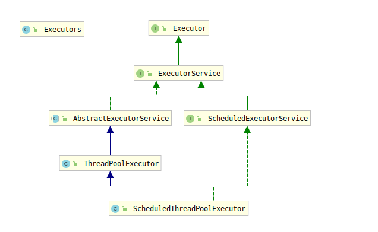

**使用线程池的三种常见方式**：

- Executors.newFixedThreadPool(int)：创建一个固定线程数量的线程池，可控制线程最大并发数，超出的线程需要在队列中等待。注意它内部corePoolSize和maximumPoolSize的值是相等的，并且使用的是**LinkedBlockingQueue**：

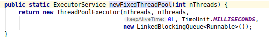
- Executors.newSingleThreadExecutor()：创建一个单线程的线程池，它只有唯一的线程来执行任务，保证所有任务按照指定顺序执行。注意它内部corePoolSize和maximumPoolSize的值都为1，它使用的是**LinkedBlockingQueue**：

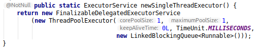
- Executors.newCachedThreadPool()：创建一个可缓存的线程池，如果线程长度超过处理需要，可灵活回收空闲线程，若无可回收线程，则创建新线程。注意它内部将corePoolSize值设为0，maximumPoolSize值设置为Integer.MAX_VALUE，并且使用的是**SynchronizedQueue**，keepAliveTime值为60，即当线程空闲时间超过60秒，就销毁线程:

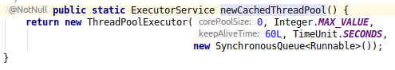

**注意**：

- 以上三种创建线程的方式内部都是由ThreadPoolExecutor这个类完成的，该类的构造方法有5个参数，称为线程池的5大参数（还有另外两个参数）；
- 线程池使用完毕之后需要关闭，应该配合try-finally代码块，将线程池关闭的代码放在finally代码块中；

#### 9.3 线程池的7大参数
ThreadPoolExecutor对构造函数进行了重载，实际内部使用了7个参数：

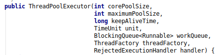
- corePoolSize：线程池中常驻核心线程池
- maximumPoolSize：线程池中能够容纳同时执行最大线程数，该值必须大于等于1
- keepAliveTime：多余线程的最大存活时间
- unit：keepAliveTime的单位
- workQueue：任务队列，被提交但尚未被执行的任务
- threadFactory：生成线程池中工作线程的线程工厂，一般使用默认即可
- handler：拒绝策略，表示当任务队列满并且工作线程大于等于线程池的最大线程数时，对即将到来的线程的拒绝策略

#### 9.4 线程池底层原理

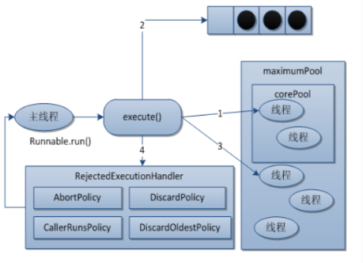

**线程池具体工作流程**：

- 在创建线程后，等待提交过来的任务请求
- 当调用execute()/submit()方法添加一个请求任务时，线程池会做出以下判断：
    - 如果正在运行的线程数量小于corePoolSize，会立刻创建线程运行该任务
    - 如果正在运行的线程数量大于等于corePoolSize，会将该任务放入阻塞队列中
    - 如果队列也满但是正在运行的线程数量小于maximumPoolSize，线程池会进行拓展，将线程池中的线程数拓展到最大线程数
    - 如果队列满并且运行的线程数量大于等于maximumPoolSize，那么线程池会启动相应的拒绝策略来拒绝相应的任务请求
- 当一个线程完成任务时，它会从队列中取下一个任务来执行
- 当一个线程空闲时间超过给定的keepAliveTime时，线程会做出判断：
    - 如果当前运行线程大于corePoolSize，那么该线程将会被停止。也就是说，当线程池的所有任务都完成之后，它会收缩到corePoolSize的大小
    
#### 9.5 线程池的拒绝策略
当线程池的阻塞队列满了同时线程池中线程数量达到了最大maximumPoolSize时，线程池将会启动相应的拒绝策略来拒绝请求任务。
4种拒绝策略具体为：
- AbortPolicy(默认)：直接抛出RejectedExecutionException异常阻止系统正常运行
- CallerRunsPolicy：调用者运行的一种机制，该策略既不会抛弃任务，也不会抛出异常，而是将某些任务回退到调用者
- DiscardOldestPolicy：抛弃队列中等待最久的任务，然后把当前任务加入到队列中尝试再次提交当前任务
- DiscardPolicy：直接丢弃任务，不予任何处理也不抛出异常。如果任务允许丢失，那么该策略是最好的方案

**注意**：

- 以上4种拒绝策略均实现了RejectedExecutionHandler接口
- 实际开发中不允许使用内置的线程池：必须明确地通过ThreadPoolExecutor方式，指定相应的线程池参数创建自定义线程或者使用3其它框架提供的线程池。因为内置线程池的第五个参数阻塞队列允许的请求队列长度为**Integer.MAX_VALUE**，可能造成大量请求堆积，导致OOM：

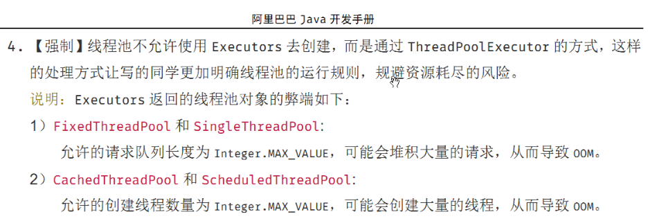

**自定义线程池**：使用不同的拒绝策略：
```java
/**
 * 自定义线程池的各个参数
 *
 * @author sherman
 */
public class CustomThreadPool {
    public static void main(String[] args) {
        ExecutorService executorService = new ThreadPoolExecutor(
                2,
                5,
                1L,
                TimeUnit.SECONDS,
                new LinkedBlockingQueue<>(3),
                // new ThreadPoolExecutor.AbortPolicy()
                new ThreadPoolExecutor.CallerRunsPolicy() // 注意使用该拒绝策略，可能会回退给main线程执行
                // new ThreadPoolExecutor.DiscardOldestPolicy()
                //new ThreadPoolExecutor.DiscardPolicy()

        );
        try {
            for (int i = 0; i < 9; i++) {
                executorService.submit(() -> {
                    System.out.println(Thread.currentThread().getName() + ": 执行任务");
                    try {
                        Thread.sleep(200);
                    } catch (InterruptedException e) {
                        e.printStackTrace();
                    }
                });
            }
        } catch (Exception e) {
            e.printStackTrace();
        } finally {
            executorService.shutdown();
        }
    }
}
```

#### 9.6 线程池配置合理线程数量
线程池合理配置线程数量需要考虑业务具体是CPU密集型还是IO密集型：
- CPU密集型：该任务需要大量运算，而没有阻塞，CPU一直在全速运行，CPU密集型只有在真正的多核CPU上才能进行加速。CPU密集型任务配置应该尽可能少的线程数量，一般公式为：
```shell
# CPU核数 + 1个线程的线程池
```
- IO密集型：任务需要大量的IO操作，即大量的阻塞。在单线程上进行IO密集型的任务会浪费大量的CPU运算能力在等待操作上。所以在IO密集型任务中使用多线程可以大大加速程序运行：
```shell
# CPU核数 / （1 - 阻塞系数）				阻塞系数在0.8-0.9
# CPU核数 * 2
```

### 十、死锁的产生和定位

#### 10.1 死锁的产生
两个及以上的线程在执行过程中，因为互相争夺资源而造成一种相互等待的现象，如果外力干涉，那么它们都将无法推进下去：
```java
/**
 * 演示死锁的产生
 *
 * @author sherman
 */
public class DeadLock implements Runnable {
    private String mutex1;
    private String mutex2;

    public DeadLock(String mutex1, String mutex2) {
        this.mutex1 = mutex1;
        this.mutex2 = mutex2;
    }

    @Override
    public void run() {
        synchronized (mutex1) {
            System.out.println(Thread.currentThread().getName() + ": 持有" + mutex1 + ", 尝试获取" + mutex2);
            try {
                // 睡眠一定时间，给别的线程获取资源，产生冲突
                Thread.sleep(1000);
            } catch (InterruptedException e) {
                e.printStackTrace();
            }
            synchronized (mutex2) {
                System.out.println(Thread.currentThread().getName() + "：持有" + mutex2 + ", 尝试获取" + mutex1);
            }
        }
    }

    public static void main(String[] args) {
        String mutex1 = "mutex1";
        String mutex2 = "mutex2";
        new Thread(new DeadLock(mutex1, mutex2), "AAA").start();
        new Thread(new DeadLock(mutex2, mutex1), "BBB").start();
    }
}
```

#### 10.2 死锁的定位
Java提供了类似于ps的命令jps来查看当前Java程序及其进程号，再通过命令jstack能够产看具体进程号的Java程序栈使用情况：
- jps -l：有一个pid为11300的Java线程：

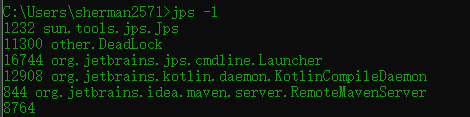

- jstack pid：使用jstack 11300继续查看该Java进程具体信息：

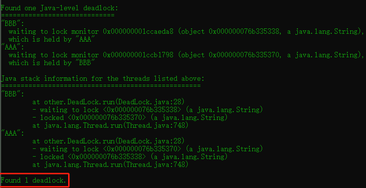

### 十一、JVM

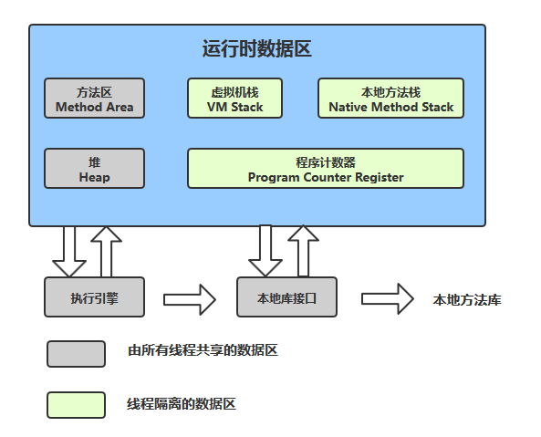

具体可以参看：https://mp.weixin.qq.com/s/WuyxyelaXbU-lg-HVZ95TA

#### 11.1 GC Roots理解
- 什么是垃圾：内存中已经不在被使用到的空间就是垃圾，要进行垃圾回收，首先需要判断一个对象是否可以被回收
- 判断一个对象是否可以被回收：
    - 引用计数法
    - 枚举根节点做可达性分析：以GC Roots集合中的对象为根节点向下进行搜索，如果对象到GC Roots没有任何引用链相连接，说明该对象不可达
- 哪些对象可以作为GC Roots的对象：
    - 虚拟机栈（栈帧中的局部变量区，也叫局部变量表）中引用的对象
    - 方法区中的类静态属性引用的对象
    - 方法区中常量引用的对象
    - 本地方法栈JNI（Native方法）引用的对象

#### 11.2 JVM参数配置
- JVM参数类型：
    - 标配参数：-version、-help、java -showversion，标配参数从Java1.0开始就有  
    - X参数：java -Xint|-Xcomp|-Xmixed -version
        - -Xint：解释执行，Java HotSpot(TM) 64-Bit Server VM (build 25.211-b12, interpreted mode)
        - -Xcomp：第一次使用就编译成本地代码，Java HotSpot(TM) 64-Bit Server VM (build 25.211-b12, compiled mode)
        - -Xmixed：混合模式，Java HotSpot(TM) 64-Bit Server VM (build 25.211-b12, mixed mode)
    - XX参数：
        - Boolean类型：-XX:+|-属性值
        ```shell
        // 开启/关闭打印GC详细信息属性
        -XX:+PrintGCDetails
        -XX:-PrintGCDetails
        
        // 开启/关闭串行垃圾回收器
        -XX:+UseSerialGC
        -XX:-UseSerialGC
        
        // 查看某个正在运行的Java程序是否开启了某个JVM参数
        jps -l
        jinfo -flag [对应的JVM参数：PrintGCDetails] [pid: 17693]
        // jinfo -flags [pid：17693] 查看所有默认的JVM参数
        // 上面这一步可能在Ubuntu中报错：
            修改/etc/sysctl.d/10-ptrace.conf：
            kernel.yama.ptrace_scope = 0
            
        
        examples:
        sherman@dell:~/workspace/idea_home$ jps -l
        2260 com.intellij.idea.Main
        17691 org.jetbrains.jps.cmdline.Launcher
        17981 sun.tools.jps.Jps
        17693 nwpu.sherman.atsilicon.session2.JVMParametersDemo
        3263 org.jetbrains.kotlin.daemon.KotlinCompileDaemon
        sherman@dell:~/workspace/idea_home$ jinfo -flag PrintGCDetails 17693
        -XX:+PrintGCDetails
        
        sherman@dell:~/workspace/idea_home$ jinfo -flags 2672
        Attaching to process ID 2672, please wait...
        Debugger attached successfully.
        Server compiler detected.
        JVM version is 25.211-b12
        Non-default VM flags: -XX:CICompilerCount=3 -XX:InitialHeapSize=197132288 -XX:MaxHeapSize=3126853632 -XX:MaxNewSize=1042284544 -XX:MinHeapDeltaBytes=524288 -XX:NewSize=65536000 -XX:OldSize=131596288 -XX:+PrintGCDetails -XX:+UseCompressedClassPointers -XX:+UseCompressedOops -XX:+UseFastUnorderedTimeStamps -XX:+UseParallelGC 
        Command line:  -XX:+PrintGCDetails -javaagent:/home/sherman/dev-tools/ideaIU-2019.1.3/lib/idea_rt.jar=44615:/home/sherman/dev-tools/ideaIU-2019.1.3/bin -Dfile.encoding=UTF-8
        ```
    - KV键值对类型：-XX:属性key=属性值value：
    ```shell
    // 设置JVM元空间大小
    -XX:MetaspaceSize=128m 				// 元空间默认大小21m左右
    // 设置从Young升到老年代区的年龄
    -XX:MaxTenuringThreshold=10         // 默认年龄15
    ```
    - 注意：-Xms和-Xmx属于KV键值对类型的缩写形式：它们分别等价于-XX:InitialHeapSize和-XX:MapHeapSize
    
#### 11.3 查看JVM默认参数
- -XX:+PrintFlagsInitial：查看JVM默认参数，能够在Java程序未运行时查看  
```shell
java -XX:+PrintFlagsInitial [version] [| grep MetaspaceSize]
```
- -XX:+PrintFlagsFinal：修改更新的参数：
```shell
java -XX:+PrintFlagsFinal [version] [| grep MetaspaceSize]

sherman@dell:~$ java -XX:+PrintFlagsFinal -version | grep InitialHeapSize
uintx InitialHeapSize                          := 197132288
// 注意：:=代表被JVM修改过或者认为修改过后的值    
```

#### 11.4 常见参数：
- -Xms：初始大小内存，默认为物理内存1/64，等价于：-XX:InitialHeapSize
- -Xmx：最大分配内存，默认为物理内存1/4，等价于：-XX:MaxHeapSize
- -Xss：设置单个线程栈的大小，一般默认为512k-1024k（依赖平台），**但是JVM该参数默认为0，代表的是使用默认值**，而不是说单个线程的大小为0，等价于：-XX:ThreadStackSize
- -Xmn：设置年轻代大小，一般不调节该参数
- -XX:MetaspaceSize：设置元空间大小，元空间并不在虚拟机中，而是使用本地内存，元空间的大小仅受本地内存限制
- -XX:SurvivorRatio： 设置新生代中Eden和s0/s1空间的比例，默认是-XX:SurivivorRatio=8，即Eden:s0:s1=8:1:1，`-XX:SurvivorRatio=4 -> Eden:s0:s1=4:1:1`
- -XX:NewRatio：配置年轻代和老年代在堆结构中的占比，默认-XX:NewRatio=2，即新生代占1，老年代占2，
`-XX:NewRatio=4 -> 新生代占1，老年代占4`，NewRatio所设置的数值为老年代占的比例，**新生代始终为1**
- -XX:MaxTenuringThreshold：设置垃圾的最大年龄，默认值为15
```shell
// 典型配置
-Xms128m -Xmx4096m -Xss1024k -XX:MetaspaceSize=512m -XX:+PrintCommandLineFlags
-XX:+PrintGCDetails -XX:+UseSerialGC
```

#### 11.5 GC日志阅读

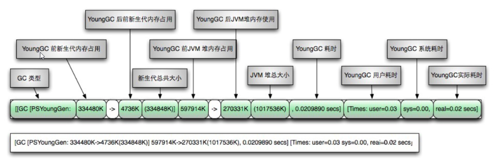

上面图是在JDK1.8之前的，没有元空间的GC日志信息，在JDK1.8及之后，GC日志一共分为4部分：
- 新生代
- 老年代
- 元空间
- GC时间

新生代、老年代、元空间的GC日志格式固定：

**名称:->\[GC前该区域内存大小\]->GC后该区域内存大小(该区域内存总大小)**

例如：

Full GC (System.gc()) \[PSYoungGen: 2496K->0K(56320K)] \[ParOldGen: 0K->2408K(128512K)] 2496K->2408K(184832K), \[Metaspace: 3006K->3006K(1056768K)], 0.0059206 secs 


### 十二、四大引用

#### 12.1 四大引用关系图
Java提供了四种引用，分别是：强引用、软引用、弱引用、虚引用，它们的关系图为：

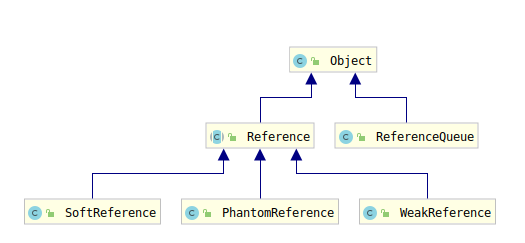

**强引用**：

当JVM进行GC时，对于强引用对象，就算出现了OOM也不会对该对象进行回收。强引用是造成Java内存泄露的主要原因之一：
```java
/**
 * 演示强引用
 *
 * @author sherman
 */
public class StrongReference {
    public static void main(String[] args) {
        Object obj1 = new Object();
        Object obj2 = obj1;
        obj1 = null;
        System.gc();
        /**
         * obj2属于强引用，不会回收
         */
        System.out.println(obj2);
    }
}
```

**软引用**：

对于软引用关联的对象，在系统将要发生内存溢出异常之前，将会把这些对象列进回收范围之内。
如果这次回收后还没有足够的内存，才会抛出异常。即：
- 当系统内存充足时，软引用不会回收；
- 当系统内存不足时，软引用会被回收，回收后内存仍然不足，就抛出异常；

软引用通常用在内存敏感的程序中，例如高速缓存中就用到软引用。软引用在Java中用
java.lang.ref.SoftReference来表示：
```java
/**
 * 演示软引用
 * VM: -Xms5m -Xmx5m -XX:+PrintGCDetails
 *
 * @author sherman
 */
public class SoftReferenceDemo {
    public static void main(String[] args) {
        Object obj1 = new Object();
        SoftReference<Object> softReference = new SoftReference(obj1);
        System.out.println(obj1);
        System.out.println(softReference.get());

        obj1 = null;
        try {
            byte[] bytes = new byte[20 * 1024 * 1024];
        } catch (Exception e) {
            e.printStackTrace();
        } finally {
            System.out.println(obj1);
            System.out.println(softReference.get());
        }
    }
}
```

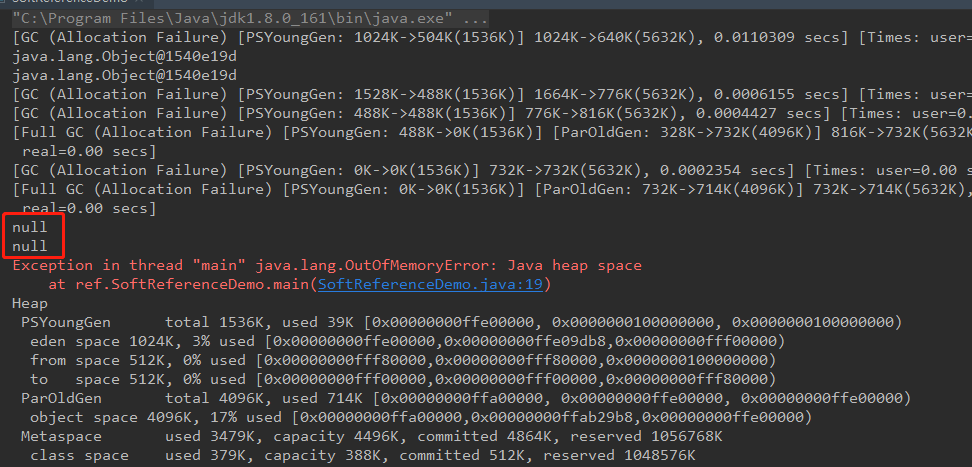

**弱引用**：

弱引用通过java.lang.ref.WeakReference来完成，当JVM进行GC时，无论内存是否充足，被弱引用关联的对象都会被回收，即弱引用关联的对象在下一次GC时必定被回收：

```java
/**
 * 演示弱引用
 *
 * @author sherman
 */
public class WeakReferenceDemo {
    public static void main(String[] args) {
        Object obj1 = new Object();
        WeakReference<Object> wr = new WeakReference<>(obj1);
        System.out.println(obj1);
        System.out.println(wr.get());

        obj1 = null;

        /**
         * 弱引用活不到下一次gc，因此即使内存充足，弱引用也会被回收
         */
        System.gc();
        System.out.println(obj1);
        System.out.println(wr.get());
    }
}

// output:
// java.lang.Object@1540e19d
// java.lang.Object@1540e19d
// null
// null
```

**虚引用**：

虚引用需要java.lang.ref.PhantomReference类来实现，如果一个对象仅持有虚引用，那么它和没有任何引用一样，调用get()方法总返回null，在任何时候都可能被垃圾回收器回收，虚引用必须和引用队列(ReferenceQueue)联合使用：

- 作用：虚引用的唯一目的就是：当该对象被垃圾收集器回收的时候收到一个系统通知或者后续添加进一步处理，即当一个对象进入finalization阶段，可以被gc回收，用来实现比finalization更加灵活的机制；
- 具体流程：创建引用时候可以指定关联的队列，当GC释放对象的时候会将引用的对象添加到引用队列中，如果程序发现某个虚引用对象已经被加入到引用队列中，那么就可以在引用对象的内存回收之前采取必要的措施，这就相当于一种通知机制；

```java
/**
 * 演示PhantomReference
 *
 * @author sherman
 */
public class PhantomReferenceDemo {
    public static void main(String[] args) throws InterruptedException {
        Object obj = new Object();
        ReferenceQueue<Object> referenceQueue = new ReferenceQueue<>();
        PhantomReference<Object> phantomReference = new PhantomReference<>(obj, referenceQueue);
        System.out.println(obj);
        /**
         * PhantomReference任何时候get都是null
         */
        System.out.println(phantomReference.get());
        System.out.println(referenceQueue.poll());

        System.out.println("===============");
        /**
         * obj=null，gc之后，引用的对象会被添加到引用队列中，
         * 因此最后的poll方法能够获取到值
         */
        obj = null;
        System.gc();
        Thread.sleep(100);
        System.out.println(obj);
        System.out.println(phantomReference.get());
        System.out.println(referenceQueue.poll());
    }
}
```

#### 12.2 软引用和弱引用使用场景
**场景**：

有一个应用需要读取大量的本地图片：如果每次读取图片都从硬盘读取则会严重影响性能；如果一次都加载到内存中有可能造成内存溢出，此时可以通过软引用或者弱引用来解决该问题。

**设计思路**：

用一个HashMap来保存图片路径和相应图片对象关联的软引用之间的映射关系，当系统内存不足时，JVM会自动回收这些缓存图片对象所占用的空间，从而有效的避免OOM：

Map<String, SoftReference<Bitmap>> imgCache = new HashMap<String, SoftReference<Bitmap>>();

#### 12.3 WeakHashMap
WeakHashMap和HashMap一样也是一个散列表，但是它的键是“弱键”，其类型是WeakReference，对于“弱键”，其**对应的映射的存在并不会阻止垃圾回收器对该键的丢弃**，也就是说，该弱键是可被终止的。当某个键被终止时，其对应的键值对映射就会从散列表中移除：

```java
/**
 * @author sherman
 */
public class WeakHashMapDemo {

    public static void main(String[] args) {
        Map<Integer, Object> weakHashMap = new WeakHashMap<>();
        Map<Integer, Object> hashMap = new HashMap<>();

        /**
         * 注意这里两个map不能共用一对key-value，会相互影响
         */
        Integer key1 = new Integer(250);
        String value1 = "value1";
        Integer key2 = new Integer(250);
        String value2 = "value2";

        weakHashMap.put(key1, value1);
        hashMap.put(key2, value2);
        System.out.println("weakHashMap: " + weakHashMap);
        System.out.println("hashMap: " + hashMap);
        key1 = null;
        key2 = null;
        System.gc();
        System.out.println("==========================");
        System.out.println("weakHashMap: " + weakHashMap);
        System.out.println("hashMap: " + hashMap);
    }
}
// 从输出结果理解：【对应的映射的存在并不会阻止垃圾回收器对该键的丢弃】的含义
// output:
// weakHashMap: {250=value1}
// hashMap: {250=value2}
// ==========================
// weakHashMap: {}
// hashMap: {250=value2}
```

### 十三、OOM
#### 13.1 Java异常和错误的继承体系

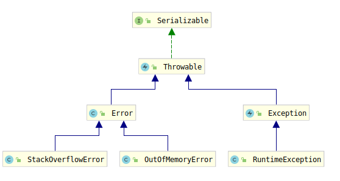

**注意**：虽然StackOverflowError和OutOfMemoryError通常口语上都称为“异常”，但是实际上它们都是Error的子类，属于错误。

#### 13.2 常见的异常和错误

**StackOverflowError**：

栈溢出异常，通常发生在递归调用且未添加终止条件时。使用 **-Xss** 参数可以更改栈的大小。

**OOM：java heap space**

当new大对象或者不断new新对象，导致new出来的内存超过了heap的大小，会导致OOM: java heap space异常:
```java
/**
 * 演示OOM：java heap size
 * VM -Xms5m -Xmx5m -XX:+PrintGCDetails
 *
 * @author sherman
 */
public class JavaHeapSpace {
    public static void main(String[] args) {
        // Exception in thread "main" java.lang.OutOfMemoryError: Java heap space
        byte[] bytes = new byte[80 * 1024 * 1024];
    }
}
```

**OOM：GC overhead limit exceeded**：

GC回收时间过长，过长的定义：**超过98%的时间用来做GC并且回收了不到2%的堆内存，连续多次GC仍然出现这种情况时，才会抛出该异常**。如果多次出现GC回收时间过长情况，但是并不抛出异常则会出现：

GC清理的内存很快又会被再次填满，迫使再次GC，形成恶性循环，CPU使用率一直在100%，而GC却没有任何效果。

```java
/**
 * 演示GC overhead limit exceeded异常
 * 
 * -Xms12m -Xmx12m -XX:+PrintGCDetails
 * 
 * 注意上面Xms和Xmx值不能太小，否则还没到达GC limit的限制就直接移除了，抛出java heap space异常
 *
 * @author sherman
 */
public class GCOverLimit {
    public static void main(String[] args) {
        int i = 0;
        List<String> lists = new ArrayList<>();
        try {
            while (true) {
                // Exception in thread "main" java.lang.OutOfMemoryError: GC overhead limit exceeded
                lists.add(String.valueOf(i++).intern());
            }
        } catch (Exception e) {
            e.printStackTrace();
        }
    }
}
```

**OOM：direct buffer memory**：

在NIO程序中，经常需要使用ByteBuffer来读取或者写入数据，这是一种基于通道(Channel)和缓冲区(Buffer)的IO方式。它可以使用Native函数库直接分配堆外内存，然后通过一个存储在Java堆里面的DirectByteBuffer对象作为这块内存引用进行操作。这样能够在一些场景中显著提高性能，因为可以避免在Java堆和Native堆中来回复制数据：
- ByteBuffer.allocate(capacity)：第一种方式是分配JVM堆内存，属于GC管辖范围，由于需要拷贝所以速度较慢；
- ByteBuffer.allocateDirect(capacity)：这种方式是分配OS本地内存，不属于GC管辖范围，由于不需要内存拷贝所以速度相对较快；

但是如果不断分配本地内存，堆内存很少使用，那么JVM就不需要执行GC，DirectBuffer对象们就不会被收，这时候堆内存充足，但是本地内存可能已经使用完毕，再次尝试分配本地内存就会出现OOM，程序直接崩溃：

```java
/**
 * 演示Direct Buffer Memory错误
 *
 * -Xms5m -Xmx5m -XX:+PrintGCDetails -XX:MaxDirectMemorySize=5m
 *
 * @author sherman
 */
public class DirectBufferMemory {
    public static void main(String[] args) {
        // 默认应该是1/4系统内存
        System.out.println("配置的堆外内存为：" + (sun.misc.VM.maxDirectMemory()) / (double) 1024 / 1024 + "MB");
        // Exception in thread "main" java.lang.OutOfMemoryError: Direct buffer memory
        ByteBuffer.allocateDirect(6 * 1024 * 1024);
    }
}
```

**OOM：unable to create new native thread**：
高并发请求服务器时，经常出现如下异常：java.lang.OutOfMemoryError：unable to create new native thread，准确的讲该native thread异常与对应的平台有关。

```java
/**
 * 演示OOM：unable to create new native thread
 * 注意：在Windows上运行这个程序容易出现假死现象！！！
 *
 * @author sherman
 */
public class UnableCreateNewNativeThread {
    public static void main(String[] args) {
        for (int i = 0; ; ++i) {
            System.out.println("+++++++" + i + "+++++++");
            // Exception in thread "main" java.lang.OutOfMemoryError: unable to create new native thread
            new Thread(() -> {
                try {
                    Thread.sleep(Integer.MAX_VALUE);
                } catch (InterruptedException e) {
                    e.printStackTrace();
                }
            }).start();
        }
    }
}
```

- 导致原因：
    - 应用创建了太多的线程，超过了系统承载极限
    - 对应的服务器不允许你的进程创建过多的线程，linux默认允许单个进程可以创建线程数1024个
- 解决方案：
    - 想办法降低你的进程创建线程的数量，分析程序是否真的需要创建那么多的线程；
    - 如果应用真的需要创建很多线程，需要修改linux默认配置，扩大linux默认限制；
- 修改native thread的上限：
```shell
# vim /etc/security/limits.d/90-nproc.conf:
* 		soft		nproc 		1024
root 	soft 		nproc		unlimited
```

**OOM：metaspace**：

Metaspace是Java8及其以后版本中使用的，用来代替永久代。Metaspace是方法区在HotSpot中的实现，它与永久带最大的区别是：Metaspace并不在JVM内存中而是直接使用本地内存。也就是说在Java8中，class metadata
(the virtual machines internal presentation of Java class)，被存储在叫做Metaspace的Native Memory中。

- 永久代（Metaspace）存储的信息：
    - JVM加载的类信息
    - 常量池
    - 静态变量
    - 即时编译后的代码
- 查看默认MetaspaceSize：默认应该是物理内存的1/4：
```shell
# windows：java -XX:+PrintFlagsInitial | findstr -i metaspacesize
# linux: java -XX:+PrintFlagsInitial | grep -i metaspacesize
```

因为Metaspace中存储了类信息，所以不断产生新的类，就会不断向Metaspace中写入数据，就有可能导致Metaspace区域溢出。 

### 十四、垃圾回收器
GC算法（引用计数、复制、标记清除、标记整理）是内存回收的方法论，垃圾回收器是方法论的落地实现。目前没有完美的的垃圾回收器，也没有万能的垃圾回收器，只能根据具体的应用选择合适的垃圾回收器。

#### 14.1 四大垃圾回收器
- 串行垃圾回收器（Serial）：为单线程环境设置并且只使用一个线程进行垃圾回收，会暂停所有的用户线程，不适合服务器环境；
- 并行垃圾回收器（Parallel）：Serial垃圾回收器的多线程版本，会开启多个线程进行垃圾回收，仍然会暂停所有的用户线程，速度较快，适用于科学计算或者大数据处理；
- 并发垃圾回收器（CMS）：用户线程和垃圾回收线程同时执行（不一定是并行，可能是交替执行），不需要暂停用户线程，适用于对响应时间要求严格的应用；
- G1垃圾回收器⭐️：将堆内存分割成不同的区域（Region）然后进行垃圾回收，并不存在明显的新生代和老年代；

Serial和Parallel垃圾回收器都会产生STW(Stop The World)问题，CMS并不会产生该问题，但是CMS的GC过程可能更加复杂，导致抢占应用程序的CPU资源。

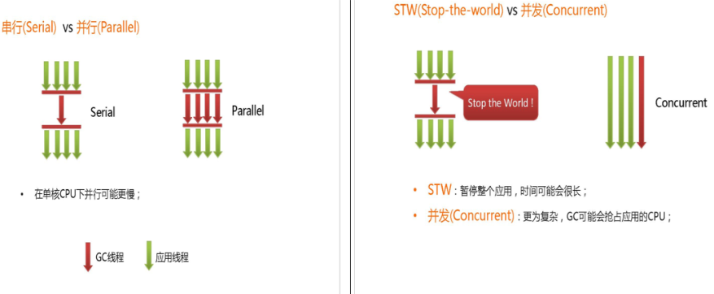

#### 14.2 默认垃圾回收器、配置
- 查看默认的垃圾回收器：java -XX:+PrintCommandLineFlags -version，Java8默认使用ParallelGC
- JVM默认的垃圾回收器（7种，有一种已经废弃）：
    - UseSerialGC <--------> ~~UseSerialOldGC~~
    - UseParallelGC <--------> UseParallelOldGC
    - UseParNewGC <--------> UseConcMarkSweepGC
    - UseG1GC
    

对于一个正在运行的Java程序，可以通过jps找到Java的pid，然后**jinfo flag UseXxxGC pid** 来查看
当前运行的程序是否开启了指定的垃圾回收器。


- JVM垃圾回收器日志中参数说明:
    - DefNew: Default New Generation
    - Tenured: 老年代
    - ParNew: Parallel New Generation
    - PSYoungGen: Parallel Scavenge
    - ParOldGen: Parallel Old Generation
- JVM中CS模式：
    - 32位Windows操作系统,无论硬件如何默认使用Client的JVM模式；
    - 32位其它操作系统,2G内存同时拥有2个cpu及以上的硬件资源使用的是Server模式,否则Client模式；；
    - 64位操作系统只有Server模式

#### 14.3 垃圾回收器详细说明
**串行垃圾回收器(Serial/Serial Copying)**：

一个单线程的垃圾回收器并且只使用单个线程进行垃圾回收在进行垃圾回收时，必须暂停其他所有的工作线程(STW)直到它的垃圾回收结束。串行垃圾回收最稳定高效，对于限定单个CPU的环境来说，没有线程交互的开销可以获得最高的单线程垃圾回收效率。因此，Serial垃圾收集器依然是JVM运行在Client模式下默认的新生代垃圾收集器。


- 对应JVM参数: -XX:+UseSerialGC
- 说明：开启SerialGC后,默认使用的配套GC是: Serial(Young区使用)+Serial Old(Old区使用)的收集器组合. 表示新生代和老年代都会使用串行垃圾回收器,新生代使用复制算法,老年代使用标记-整理算法。
- 配置运行说明：DefNew&Tenured

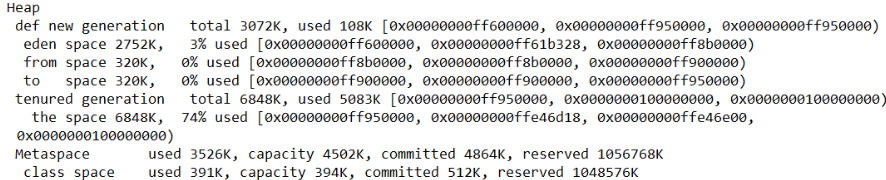

**并行垃圾回收器(ParNew)**：

使用多个线程进行垃圾回收，是Serial收集器新生代的并行多线程版本，在进行垃圾回收时仍然会出现STW问题直至它的回收工作结束，它是很多JVM运行在Server模式下的新生代默认垃圾回收器。

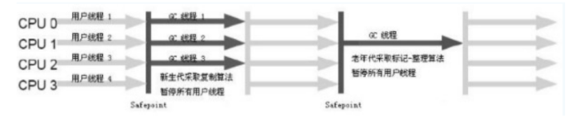

- 对应JVM参数: -XX:+UseParNewGC
- 说明：开启ParNewGC后，默认使用的配套GC是：ParNew(Young区使用)+Serial Old(Old区使用)的垃圾收集器组合，相对于Serial来说只会影响新生代，不影响老年代。新生代使用复制算法，老年代使用标记-整理算法。但是，ParNew&Serial Old在Java8已经不推荐被使用：`Using the ParNew young collector with Serial old collector is deprecated and will likely be removed in future release`。更加推荐的组合是：ParNew&CMS
- 备注:-XX:ParallelGCThreads参数可以限定回收线程的数量，默认开启和CPU数目相同的线程数
- 配置运行说明：ParNew&Tenured

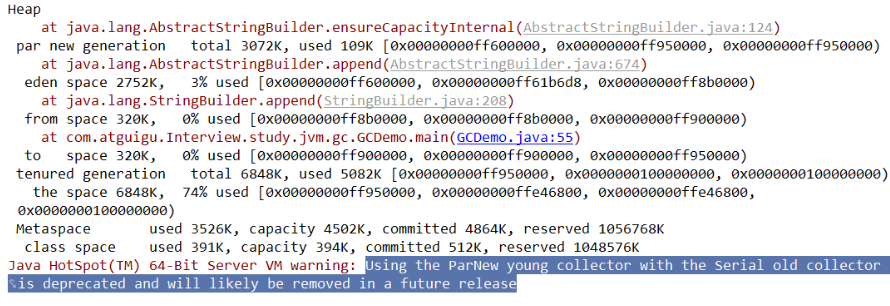

**并行收集器(Parallel Scavenge)**：
Parallel Scavenge收集器类似于ParNew，也是一个新生代垃圾并行多线程收集器，使用复制算法，俗称吞吐量(CPU运行用户代码的时间和CPU总消耗时间的比值，即吞吐量=运行用户代码时间/(运行用户代码时间+垃圾收集时间))优先收集器。总的来说，相对于ParNew收集器而言：Parallel Scavenge是在新生代和老年代都是并行多线程处理的垃圾回收器，它是Java8默认的垃圾回收器。

高吞吐量意味着高效利用CPU的时间，它多用于在后台运算而不需要太多的交互任务。

除此之外，相对于ParNew收集器而言，PS收集器存在一个自适应调节策略：JVM会根据当前系统的运行情况收集性能监控信息，动态调节这些参数以提供最合适的停顿时间(-XX:MaxPauseGCMillis)或最大吞吐量。

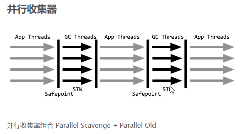

- 对应JVM参数：-XX:+UseParallelGC或-XX:+UseParallelOldGC可以相互激活；
- 说明：开启该参数后，新生代使用复制算法，老年代使用标记-整理算法；
- 备注：-XX:ParallelGCThreads=N表示开启多少个GC线程，如果CPU核数>8, N = 5/8，否则N=CPU核数；
- 配置运行说明：PSYoungGen&ParOldGen

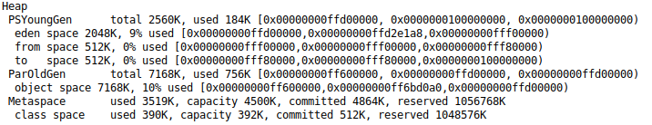

**Parallel Old收集器**：
Parallel Old收集器是PS的老年代版本，使用多线程的标记-整理算法，Parallel Old是JDK1.6才开始提供的。在JDK1.6之前，新生代使用PS收集器只能在老年代配合Serial Old收集器，只能保证在新生代的吞吐量有限，无法保证整体的吞吐量。

Parallel Old正是为了在老年代同样提供吞吐量优先的垃圾回收器，如果系统对吞吐量要求较高，在JDK1.8版本都是使用Parallel Scavenge&Parallel Old垃圾收集器组合。
- 对应JVM参数：-XX:+UseParallelOldGC, 和-XX:+UseParallelGC相互激活；

**并发标记清除收集器(CMS)**：
CMS收集器是标记-清除GC算法的落地实现，是一种以获得最短停顿时间为目标的收集器，适合应用在互联网站或者B/S系统的服务器上，这类应用尤其重视服务器的响应速度，希望系统停顿时间最短CMS非常适合堆内存大, CPU核数多的服务器应用，也是G1收集器出现之前大型应用的首选收集器。

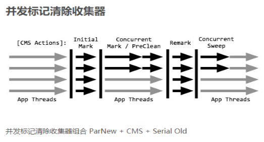

- 对应JVM参数：-XX:+UseConcMarkSweepGC，同时会自动开启-XX:+UseParallelGC，开启该参数后，会自动使用: ParNew(Young区使用)&CMS(Old区使用)&Serial Old的收集器组合，Serial Old将作为CMS出错后的备用收集器；
- 收集过程：
    - 初始标记(CMS initial mark): 只是标记一下GC Roots能够直接关联的对象，速度很快，但是存在STW；
    - 并发标记(CMS concurrent mark): 进行GC Roots跟踪过程，和用户线程一起工作，没有STW过程，主要是标记过程，会标记全部对象；
    - 重新标记(CMS remark): 为了修正在并发标记期间，因为用户程序继续运行而导致标记产生变动的那一部分对象的标记记录，仍然存在STW过程。因为并发标记时，用户线程亦然可以运行，因此在正式清理之前，再一次修正工作。
    - 并发清除(CMS concurrent sweep): 清除GC Roots不可达对象，和用户线程一起工作，不需要暂停工作线程，根据标记结果，直接清除对象。由于耗时最长的并发标记和并发清除过程中，GC线程和用户线程可以同时工作，因此总体上来看CMS收集器的内存回收和用户线程是一起并发地执行。
- 优缺点：
    - 并发收集停顿低,它本身就是以最短停顿时间为目标的垃圾回收器；
    - 并发执行对CPU资源压力较大：由于并发执行，CMS在垃圾回收时会与应用线程同时增加对堆内存的占用，也就是说，CMS必须要在老年代堆内存用尽之前完成垃圾回收，否则CMS回收失败，将会触发担保机制。此时Serial Old收集器会作为后备收集器，以STW的方式进行一次GC，造成较大的停顿时间；
    - CMS收集器是标记-清除算法的落地实现，就标记-清除算法而言本身存在内存碎片的问题，老年代的空间会随着应用时长被逐渐用尽，最后不得不通过担保机制对堆内存进行一次压缩，CMS提供了参数：-XX:CMSFullGCsBeforeCompaction(默认0, 表示每次都进行内存整理)来指定多少次CMS收集之后，再进行一次压缩的Full GC。
- 配置运行说明：ParNew&CMS&Serial Old

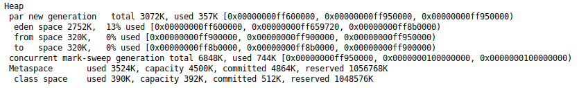

**Serial Old收集器**：
Serial Old收集器是Serial收集器的老年代版本，同样是单线程收集器，使用标记-整理算法，该收集器主要在Client模式下老年代使用。

在Server模式下，Serial Old收集器的主要作用有：
- 在JDK1.6之前，在老年代和新生代Parallel Scavenge配合使用；
- 作为ParNew&CMS的后备收集器；

注意：在Java8中**不能**使用JVM参数-XX:+UseSerialOldGC来开启Serial Old收集器。

**G1收集器**：
G1收集器是一种面向服务端的垃圾回收器，应用在多处理器和大容量内存环境中，在实现高吞吐量的同时，尽可能满足垃圾收集暂停时间的要求，用于取代CMS垃圾收集器，在JDK9中，G1是默认的垃圾回收器。

在G1收集器中，Region之间的对象引用及其他收集器中的新生代和老年代之间的对象引用，JVM都是通过Remembered Set来避免全堆扫描。G1中每个Region都有一个与之对应的Remembered Set，JVM发现程序对Reference引用的对象进行写操作时，会产生一个写中断(Write Barrier)，检查Reference引用的对象是否处于不同的Region之中(例如检查是否老年代中的对象引用了新生代中的对象)，如果是，便通过CardTable把相关用信息记录到被引用对象所属的Region的Remembered Set中。当进行内存回收时，在GC更节点的枚举范围内加入Remembered Set即可保证不对全堆扫描也不会有遗漏(注: 这也说明GC Roots中的对象也可以是属于Remembered Set中的对象)。
- 特点：
    - 可以和用户线程并行执行，尽量缩短STW时间；
    - 分代收集：虽然G1收集器不需要配合其它收集器就能独立管理整个GC堆，但是它仍然保留新生代和老年代的概念，它将整个Java堆划分为多个大小相等的独立区域(Region)，新生代和老年代也不再需要物理隔离，它们都是Region的集合，每个Region大小从1M到32M不等，每个Region可能是Eden有可能
    是Tenured内存区域；
    - 空间整理：G1整体上是使用标记-整理算法，从局部(两个Region之间)看使用的是复制算法，这样的空间整理算法会使G1在运行期间不会产生内存碎片，内存回收之后可以提供规整的可用内存；
    - :star:可预测的停顿时间：G1除了追求低停顿时间之外，还建立了可预测的停顿时间模型，可以让用户明确指定一个长度为M毫秒的时间片段，消耗在垃圾收集器上的时间不得超过N毫秒。
- 原理：G1收集器将区域化的内存分割成大小不等的Region，范围在1M到32M，JVM在启动时会自动设置这些区域的大小，最多能够设置2048个区域，即最大能够支持的内存为32MB * 2048 = 64GB。在堆内存使用上，G1并不要求对象一定存储在物理连续的内存上只要逻辑上连续即可，每个分区也不会固定地为某个代服
务，可以按需在新生代和老年代之间切换。

在G1中还有一个特殊的区域(Humongous)区域，如果一个对象占用的内存超过了分区容量的50%，这样的巨型对象会直接被分配在老年代，但是它会对垃圾回收产生负面影响。为了解决这个问题，G1专门划分了一个Humongous区域，专门存放巨型对象。如果一个H区不能装下巨型对象，那么G1会寻找连续的H分区来存储，
有时为了能够找到连续的H区，不得不启动一次Full GC。

- G1收集器的运作步骤(不考虑Remembered Set)：
    - 初始标记: 只对GC Roots能够直接关联到的对象进行标记，存在STW；
    - 并发标记: 对GC Roots关联的对象进行可达性分析，可以并发执行；
    - 最终标记: 修正并发标记期间因为应用程序继续执行而导致变化的那一部分对象，存在STW；
    - 筛选回收: 根据时间来进行价值最大化的回收；

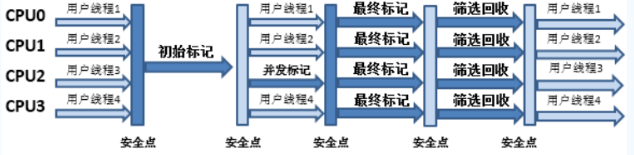

- G1常用参数：
    - -XX:+UseG1GC
    - -XX:G1HeapRegionSize=n: G1Region的大小，值必须是2的幂，范围在1MB到32MB
    - -XX:MaxGCPauseMillis=n：最大GC停顿时间大小
    - -XX:ConcGCThreads=n：并发GC使用的线程数
- 相对CMS优势：
    - 不产生内存碎片
    - 可以让用户指定期望的GC停顿时间，G1会根据允许的停顿时间区收集回收价值最高的垃圾

#### 14.4 垃圾回收器选择
- 单CPU或小内存,单机程序:-XX:+UseSerialGC
- 多CPU,需要最大吞吐量,如后台计算型应用:-XX:+UseParallelGC或者-XX:+UseParallelOldGC
- 多CPU,追求低停顿时间,快速响应如互联网应用:-XX:+UseConcMarkSweepGC或者-XX:+UseParNewGC